# Entity Relationship Diagram (ERD)
**Green School Management System**

**Date**: October 23, 2025  
**Database**: PostgreSQL 14+  
**Schema Version**: 1.0

---

## ERD Diagram (Mermaid)

```mermaid
erDiagram
    schools ||--o{ users : "has many"
    schools ||--o{ teachers : "has many"
    schools ||--o{ students : "has many"
    schools ||--o{ parents : "has many"
    schools ||--o{ subjects : "has many"
    schools ||--o{ rooms : "has many"
    schools ||--o{ classes : "has many"
    schools ||--o{ lessons : "has many"
    
    users ||--o| teachers : "has profile"
    users ||--o| students : "has profile"
    users ||--o| parents : "has profile"
    users ||--o{ rooms : "owns"
    
    teachers ||--o{ classes : "teaches"
    teachers ||--o{ lessons : "plans"
    
    subjects ||--o{ classes : "offered as"
    subjects ||--o{ lessons : "taught in"
    
    rooms ||--o{ classes : "held in"
    
    classes ||--o{ student_classes : "enrolls"
    classes ||--o{ lessons : "contains"
    
    students ||--o{ student_classes : "enrolled in"
    students ||--o{ parent_student_relationships : "has guardians"
    
    parents ||--o{ parent_student_relationships : "guardian of"
    
    lessons }o--|| classes : "belongs to"
    lessons }o--|| teachers : "planned by"
    lessons }o--|| subjects : "teaches"
    lessons }o--o| lessons : "template"

    schools {
        uuid id PK
        varchar name UK
        varchar slug UK
        varchar address_line1
        varchar address_line2
        varchar city
        varchar state
        varchar postal_code
        varchar country
        varchar phone
        varchar email
        varchar website_url
        varchar facebook_url
        varchar twitter_url
        varchar instagram_url
        varchar logo_url
        uuid principal_id FK
        uuid hod_id FK
        varchar timezone
        varchar locale
        jsonb settings
        varchar status
        timestamp created_at
        timestamp updated_at
        uuid created_by FK
        uuid updated_by FK
        timestamp deleted_at
        uuid deleted_by FK
    }

    users {
        uuid id PK
        uuid school_id FK
        varchar email UK
        varchar password_hash
        varchar first_name
        varchar last_name
        varchar persona
        varchar status
        varchar phone
        varchar avatar_url
        boolean email_verified
        timestamp last_login
        varchar keycloak_id UK
        jsonb metadata
        timestamp created_at
        timestamp updated_at
        uuid created_by FK
        uuid updated_by FK
        timestamp deleted_at
        uuid deleted_by FK
    }

    teachers {
        uuid id PK
        uuid school_id FK
        uuid user_id FK "UK"
        varchar employee_id
        date hire_date
        date termination_date
        varchar department
        varchar job_title
        varchar certification_number
        date certification_expiry
        varchar education_level
        varchar university
        int_array grade_levels
        text_array specializations
        varchar employment_type
        decimal salary
        int work_hours_per_week
        varchar emergency_contact_name
        varchar emergency_contact_phone
        varchar emergency_contact_relationship
        varchar status
        boolean is_active
        text bio
        varchar office_room
        jsonb office_hours
        jsonb preferences
        timestamp created_at
        timestamp updated_at
        uuid created_by FK
        uuid updated_by FK
        timestamp deleted_at
        uuid deleted_by FK
    }

    students {
        uuid id PK
        uuid school_id FK
        uuid user_id FK "UK"
        varchar student_id
        int grade_level
        date date_of_birth
        varchar gender
        date enrollment_date
        date graduation_date
        text allergies
        text medical_notes
        varchar emergency_contact_name
        varchar emergency_contact_phone
        varchar emergency_contact_relation
        varchar photo_url
        varchar status
        timestamp created_at
        timestamp updated_at
        uuid created_by FK
        uuid updated_by FK
        timestamp deleted_at
        uuid deleted_by FK
    }

    parents {
        uuid id PK
        uuid school_id FK
        uuid user_id FK "UK"
        varchar occupation
        varchar workplace
        varchar phone_mobile
        varchar phone_work
        varchar preferred_contact_method
        boolean emergency_contact
        boolean pickup_authorized
        boolean receives_newsletter
        timestamp created_at
        timestamp updated_at
        uuid created_by FK
        uuid updated_by FK
        timestamp deleted_at
        uuid deleted_by FK
    }

    parent_student_relationships {
        uuid id PK
        uuid parent_id FK
        uuid student_id FK
        varchar relationship_type
        boolean is_primary_contact
        boolean has_legal_custody
        boolean has_pickup_permission
        timestamp created_at
        timestamp updated_at
        uuid created_by FK
        uuid updated_by FK
        timestamp deleted_at
        uuid deleted_by FK
    }

    subjects {
        uuid id PK
        uuid school_id FK
        varchar code
        varchar name
        text description
        varchar category
        varchar subject_type
        int_array grade_levels
        varchar color
        varchar icon
        int display_order
        decimal credits
        boolean is_required
        boolean is_active
        timestamp created_at
        timestamp updated_at
        uuid created_by FK
        uuid updated_by FK
        timestamp deleted_at
        uuid deleted_by FK
    }

    rooms {
        uuid id PK
        uuid school_id FK
        uuid owner_id FK
        varchar room_number
        varchar building
        int floor
        varchar room_type
        varchar room_name
        text description
        int capacity
        decimal area_sqft
        text_array equipment
        text_array features
        boolean is_active
        boolean is_available
        varchar color
        varchar icon
        int display_order
        timestamp created_at
        timestamp updated_at
        uuid created_by FK
        uuid updated_by FK
        timestamp deleted_at
        uuid deleted_by FK
    }

    classes {
        uuid id PK
        uuid school_id FK
        uuid subject_id FK
        uuid teacher_id FK
        uuid room_id FK
        varchar code
        varchar name
        text description
        int grade_level
        varchar quarter
        varchar academic_year
        int max_students
        int current_enrollment
        jsonb schedule
        boolean is_active
        varchar color
        int display_order
        timestamp created_at
        timestamp updated_at
        uuid created_by FK
        uuid updated_by FK
        timestamp deleted_at
        uuid deleted_by FK
    }

    student_classes {
        uuid id PK
        uuid student_id FK
        uuid class_id FK
        date enrollment_date
        date drop_date
        varchar status
        varchar final_grade
        decimal final_score
        timestamp created_at
        timestamp updated_at
        uuid created_by FK
        uuid updated_by FK
        timestamp deleted_at
        uuid deleted_by FK
    }

    lessons {
        uuid id PK
        uuid school_id FK
        uuid class_id FK
        uuid teacher_id FK
        uuid subject_id FK
        varchar title
        int lesson_number
        date scheduled_date
        int duration_minutes
        text description
        text_array learning_objectives
        text_array materials_needed
        text_array curriculum_standards
        text introduction
        text main_activity
        text assessment
        text homework
        text notes
        jsonb attachments
        text_array links
        varchar status
        int completion_percentage
        int actual_duration_minutes
        text reflection
        text what_went_well
        text what_to_improve
        text modifications_needed
        varchar color
        boolean is_template
        uuid template_id FK
        timestamp created_at
        timestamp updated_at
        uuid created_by FK
        uuid updated_by FK
        timestamp deleted_at
        uuid deleted_by FK
    }
```



---

## Table Descriptions

### 1. schools
**Purpose**: Multi-tenant foundation - one record per school  
**Key Features**:
- Unique name and slug for identification
- Complete address and contact information
- Social media links
- Leadership references (principal, HOD)
- Localization settings (timezone, locale)
- Flexible settings storage (JSONB)

**Relationships**:
- One-to-Many: users, teachers, students, parents, subjects, rooms, classes, lessons
- Self-referencing: principal_id, hod_id → users

---

### 2. users
**Purpose**: Authentication and user management across all personas  
**Key Features**:
- Multi-persona support (administrator, teacher, student, parent, vendor)
- Keycloak SSO integration
- Email verification tracking
- Flexible metadata storage

**Relationships**:
- Many-to-One: school
- One-to-One: teacher_profile, student_profile, parent_profile
- One-to-Many: owned_rooms

**Personas**:
- `administrator`: School administrators
- `teacher`: Teaching staff
- `student`: Students (Grades 1-7)
- `parent`: Parents/guardians
- `vendor`: External vendors

---

### 3. teachers
**Purpose**: Teacher profiles with employment and teaching details  
**Key Features**:
- Employment tracking (hire date, termination, salary)
- Teaching credentials (certification, education)
- Grade level and subject specializations
- Emergency contact information
- Office hours and preferences

**Relationships**:
- Many-to-One: school, user
- One-to-Many: classes, lessons

**Business Rules**:
- One teacher per user (unique constraint on user_id)
- Grade levels must be 1-7
- Salary must be non-negative

---

### 4. students
**Purpose**: Student profiles and academic tracking  
**Key Features**:
- Grade level (1-7)
- Medical information (allergies, notes)
- Emergency contacts
- Enrollment and graduation tracking
- Photo storage

**Relationships**:
- Many-to-One: school, user
- One-to-Many: student_classes, parent_student_relationships

**Business Rules**:
- One student per user (unique constraint on user_id)
- Grade level must be 1-7
- Date of birth must be before enrollment date

---

### 5. parents
**Purpose**: Parent/guardian profiles and contact management  
**Key Features**:
- Employment information
- Multiple contact methods
- Emergency contact designation
- Pickup authorization
- Newsletter preferences

**Relationships**:
- Many-to-One: school, user
- One-to-Many: parent_student_relationships

**Business Rules**:
- One parent per user (unique constraint on user_id)
- Can be linked to multiple students

---

### 6. parent_student_relationships
**Purpose**: Many-to-many relationship between parents and students  
**Key Features**:
- Relationship type (mother, father, guardian, etc.)
- Primary contact designation
- Legal custody tracking
- Pickup permission management

**Relationships**:
- Many-to-One: parent, student

**Business Rules**:
- Unique parent-student combination
- Supports multiple parents per student
- Supports multiple students per parent

---

### 7. subjects
**Purpose**: Academic subjects/courses offered at the school  
**Key Features**:
- Subject code and name
- Category (core, elective, enrichment, remedial)
- Grade level applicability (array)
- Display properties (color, icon, order)
- Credit hours tracking
- Required vs elective designation

**Relationships**:
- Many-to-One: school
- One-to-Many: classes, lessons

**Business Rules**:
- Unique code per school
- Grade levels must be subset of [1,2,3,4,5,6,7]
- Color must be valid hex code

**Common Subjects**:
- MATH (Mathematics)
- ELA (English Language Arts)
- SCIENCE (Science)
- SOCIAL_STUDIES (Social Studies)
- ART (Art)
- PE (Physical Education)
- MUSIC (Music)
- LIBRARY (Library)

---

### 8. rooms
**Purpose**: Facility management for classrooms and specialized spaces  
**Key Features**:
- Room identification (number, building, floor)
- Room type classification
- Capacity tracking
- Equipment and features (arrays)
- Ownership assignment
- Availability status

**Relationships**:
- Many-to-One: school, owner (user)
- One-to-Many: classes

**Business Rules**:
- Unique room number per school
- Capacity must be positive
- Floor must be between -2 and 10

**Room Types**:
- `classroom`: Standard classroom
- `lab`: Laboratory
- `gym`: Gymnasium
- `library`: Library
- `office`: Office space
- `cafeteria`: Cafeteria

---

### 9. classes
**Purpose**: Class sections for organizing students and curriculum  
**Key Features**:
- Class code and name
- Grade level and quarter
- Academic year tracking
- Capacity management (max students, current enrollment)
- Schedule storage (JSONB)
- Display properties

**Relationships**:
- Many-to-One: school, subject, teacher, room
- One-to-Many: student_classes, lessons

**Business Rules**:
- Unique code per school
- Grade level must be 1-7
- Quarter must be Q1, Q2, Q3, or Q4
- Current enrollment ≤ max students

---

### 10. student_classes
**Purpose**: Student enrollment in classes (many-to-many)  
**Key Features**:
- Enrollment and drop dates
- Status tracking (enrolled, dropped, completed, withdrawn)
- Final grades and scores
- Audit trail

**Relationships**:
- Many-to-One: student, class

**Business Rules**:
- Unique student-class combination
- Final score must be 0-100
- Status must be valid enum value

---

### 11. lessons
**Purpose**: Lesson planning and curriculum management  
**Key Features**:
- Lesson identification (title, number)
- Scheduling (date, duration)
- Learning objectives and materials (arrays)
- Lesson plan sections (introduction, activity, assessment, homework)
- Resources (attachments, links)
- Status and progress tracking
- Reflection and improvement notes
- Template support

**Relationships**:
- Many-to-One: school, class, teacher, subject
- Self-referencing: template_id → lessons

**Business Rules**:
- Unique lesson number per class
- Lesson number must be positive
- Duration must be positive
- Completion percentage must be 0-100
- Status must be valid enum value

**Lesson Statuses**:
- `draft`: Being planned
- `scheduled`: Ready for delivery
- `in_progress`: Currently being taught
- `completed`: Finished
- `cancelled`: Cancelled

---

## Audit Fields (All Tables)

Every table includes these audit fields for compliance and tracking:

| Field | Type | Purpose |
|-------|------|---------|
| created_at | TIMESTAMP | Record creation timestamp |
| updated_at | TIMESTAMP | Last update timestamp |
| created_by | UUID | User who created the record |
| updated_by | UUID | User who last updated the record |
| deleted_at | TIMESTAMP | Soft delete timestamp (NULL = active) |
| deleted_by | UUID | User who deleted the record |

**Soft Delete**: All tables use soft delete (deleted_at) to maintain audit trail and support data recovery.

---

## Indexes

### Standard Indexes (All Tables)
- `idx_{table}_school_id` - Multi-tenant filtering
- `idx_{table}_status` - Status filtering (where applicable)
- `idx_{table}_deleted_at` - Soft delete filtering

### Specialized Indexes

**schools**:
- `idx_schools_slug` (UNIQUE)
- `idx_schools_status`

**users**:
- `idx_users_email` (UNIQUE)
- `idx_users_persona`
- `idx_users_keycloak_id` (UNIQUE)

**teachers**:
- `idx_teachers_user_id` (UNIQUE)
- `idx_teachers_employee_id` (school_id, employee_id)
- `idx_teachers_grade_levels` (GIN)
- `idx_teachers_specializations` (GIN)

**students**:
- `idx_students_user_id` (UNIQUE)
- `idx_students_student_id` (school_id, student_id - UNIQUE)
- `idx_students_grade_level`

**subjects**:
- `idx_subjects_school_code` (school_id, code - UNIQUE)
- `idx_subjects_category`
- `idx_subjects_grade_levels` (GIN)

**rooms**:
- `idx_rooms_number_school` (school_id, room_number - UNIQUE)
- `idx_rooms_type`

**classes**:
- `idx_classes_code_school` (school_id, code - UNIQUE)
- `idx_classes_grade_level`
- `idx_classes_quarter`
- `idx_classes_academic_year`

**lessons**:
- `idx_lessons_class_id`
- `idx_lessons_teacher_id`
- `idx_lessons_subject_id`
- `idx_lessons_scheduled_date`
- `idx_lessons_is_template`
- `uq_lessons_number_class` (class_id, lesson_number, deleted_at - UNIQUE)

---

## Constraints

### Check Constraints

**schools**:
- `status IN ('active', 'inactive', 'suspended')`

**users**:
- `persona IN ('administrator', 'teacher', 'student', 'parent', 'vendor')`
- `status IN ('active', 'inactive', 'suspended')`

**teachers**:
- `status IN ('active', 'inactive', 'on_leave', 'terminated')`
- `employment_type IN ('full-time', 'part-time', 'contract', 'substitute')`
- `grade_levels <@ ARRAY[1,2,3,4,5,6,7]`
- `education_level IN ('High School', 'Associate', 'Bachelor''s', 'Master''s', 'PhD', 'Other')`
- `salary >= 0`
- `work_hours_per_week > 0`

**students**:
- `grade_level BETWEEN 1 AND 7`
- `status IN ('enrolled', 'graduated', 'transferred', 'withdrawn', 'suspended')`
- `gender IN ('male', 'female', 'other', 'prefer_not_to_say')`
- `date_of_birth < enrollment_date`

**subjects**:
- `category IN ('core', 'elective', 'enrichment', 'remedial', 'other')`
- `subject_type IN ('academic', 'arts', 'physical', 'technical', 'other')`
- `grade_levels <@ ARRAY[1,2,3,4,5,6,7]`
- `credits >= 0`
- `color ~ '^#[0-9A-Fa-f]{6}$'`

**rooms**:
- `room_type IN ('classroom', 'lab', 'gym', 'library', 'office', 'cafeteria')`
- `capacity > 0`
- `floor >= -2 AND floor <= 10`

**classes**:
- `grade_level >= 1 AND grade_level <= 7`
- `quarter IN ('Q1', 'Q2', 'Q3', 'Q4')`
- `max_students > 0`
- `current_enrollment >= 0 AND current_enrollment <= max_students`

**student_classes**:
- `status IN ('enrolled', 'dropped', 'completed', 'withdrawn')`
- `final_score >= 0 AND final_score <= 100`

**lessons**:
- `status IN ('draft', 'scheduled', 'in_progress', 'completed', 'cancelled')`
- `lesson_number > 0`
- `duration_minutes > 0`
- `completion_percentage >= 0 AND completion_percentage <= 100`

### Foreign Key Constraints

All foreign keys use appropriate ON DELETE actions:
- `CASCADE`: Delete child records when parent is deleted (school_id, user_id)
- `RESTRICT`: Prevent deletion if child records exist (teacher_id, subject_id)
- `SET NULL`: Set to NULL when parent is deleted (room_id, owner_id, template_id)

---

## Row Level Security (RLS)

All tables have RLS enabled for multi-tenant data isolation:

```sql
-- Enable RLS
ALTER TABLE {table_name} ENABLE ROW LEVEL SECURITY;

-- School isolation policy
CREATE POLICY {table}_school_isolation ON {table}
    USING (
        school_id::text = current_setting('app.current_school_id', true)
        OR current_setting('app.user_role', true) = 'system_admin'
    );

-- Self-view policy (for users table)
CREATE POLICY users_view_self ON users
    FOR SELECT
    USING (
        id::text = current_setting('app.current_user_id', true)
        OR school_id::text = current_setting('app.current_school_id', true)
    );
```

**Session Variables**:
- `app.current_school_id`: Current user's school ID
- `app.current_user_id`: Current user's ID
- `app.user_role`: Current user's role (for system admin bypass)

---

## Data Types

### Standard Types
- **UUID**: All primary keys and foreign keys
- **VARCHAR(n)**: Text fields with length limits
- **TEXT**: Unlimited text fields
- **INTEGER**: Whole numbers
- **DECIMAL(p,s)**: Precise decimal numbers
- **BOOLEAN**: True/false flags
- **DATE**: Date only (no time)
- **TIMESTAMP**: Date and time

### PostgreSQL-Specific Types
- **JSONB**: Flexible JSON data storage (settings, metadata, schedule)
- **ARRAY**: Arrays of integers or text (grade_levels, equipment, features)

### Array Usage
- `INT[]`: Grade levels, numeric lists
- `TEXT[]`: Specializations, equipment, features, learning objectives, materials

### JSONB Usage
- `settings`: School configuration
- `metadata`: User metadata
- `office_hours`: Teacher availability
- `preferences`: User preferences
- `schedule`: Class schedule
- `attachments`: Lesson attachments

---

## Migration Status

| Migration | Table | Status | Created |
|-----------|-------|--------|---------|
| 001 | schools | ✅ Complete | 2025-10-13 |
| 002 | users | ✅ Complete | 2025-10-13 |
| 003 | teachers | ✅ Complete | 2025-10-15 |
| 004 | students | ❌ Missing | - |
| 005 | parents | ❌ Missing | - |
| 006 | parent_student_relationships | ❌ Missing | - |
| 007 | subjects | ❌ Missing | - |
| 008 | rooms | ❌ Missing | - |
| 009 | classes | ❌ Missing | - |
| 010 | student_classes | ❌ Missing | - |
| 011 | lessons | ❌ Missing | - |

**Note**: Migrations 004-011 need to be created. Models exist but database tables are not yet created.

---

## Database Statistics

| Metric | Count |
|--------|-------|
| Total Tables | 11 |
| Tables with Migrations | 3 |
| Total Relationships | 24 |
| One-to-Many Relationships | 20 |
| Many-to-Many Relationships | 2 |
| Self-Referencing Relationships | 2 |
| Total Indexes | 45+ |
| Unique Constraints | 15 |
| Check Constraints | 30+ |
| Foreign Keys | 24 |

---

## Key Design Patterns

### 1. Multi-Tenancy
- All tables include `school_id` foreign key
- Row Level Security enforces data isolation
- Composite unique constraints include `school_id`

### 2. Soft Delete
- All tables include `deleted_at` and `deleted_by`
- Queries filter on `deleted_at IS NULL`
- Maintains audit trail and supports data recovery

### 3. Audit Trail
- All tables track creation and modification
- `created_at`, `updated_at`, `created_by`, `updated_by`
- Supports compliance and debugging

### 4. Flexible Data Storage
- JSONB for settings, metadata, preferences
- Arrays for multi-value fields
- Supports schema evolution without migrations

### 5. Enum Enforcement
- CHECK constraints for status fields
- Consistent enum values across layers
- Database-level validation

### 6. Relationship Patterns
- One-to-One: user → teacher/student/parent
- One-to-Many: school → users, teacher → classes
- Many-to-Many: parents ↔ students, students ↔ classes
- Self-Referencing: schools.principal_id, lessons.template_id

---

## Future Enhancements

### Planned Tables (Not Yet Implemented)
1. **assessments**: Student assessments and grading
2. **attendance**: Daily attendance tracking
3. **events**: School calendar events
4. **activities**: Extracurricular activities
5. **vendors**: Vendor management
6. **merits**: Student reward system

### Planned Features
- Full-text search indexes
- Materialized views for reporting
- Partitioning for large tables
- Archive tables for historical data

---

## References

- **Code Review Report**: `/CODE_REVIEW_REPORT.md`
- **Field Analysis Report**: `/FIELD_ANALYSIS_REPORT.md`
- **Master Feature Plan**: `/docs/MASTER_FEATURE_PLAN.md`
- **API Routes**: `/docs/api/API_ROUTES_MASTER.md`
- **Migrations**: `/backend/migrations/`
- **Models**: `/backend/models/`

---

**Document Version**: 1.0  
**Last Updated**: October 23, 2025  
**Next Review**: After migration creation
