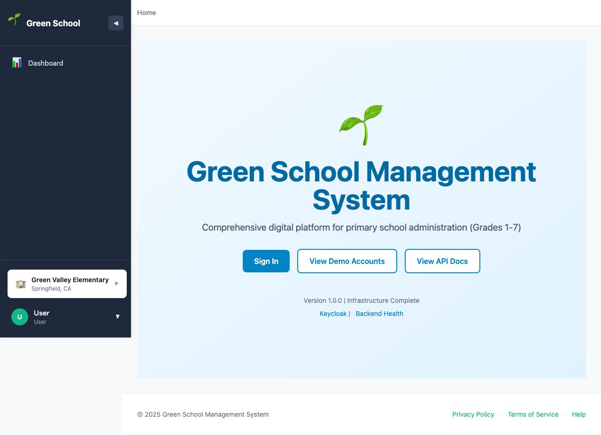
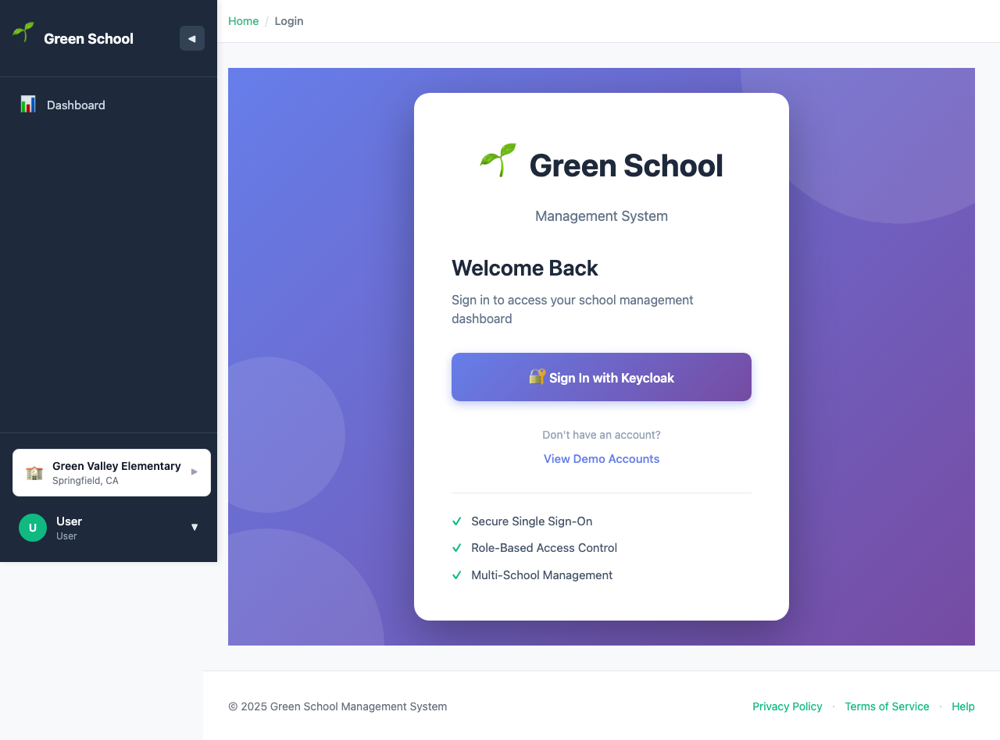
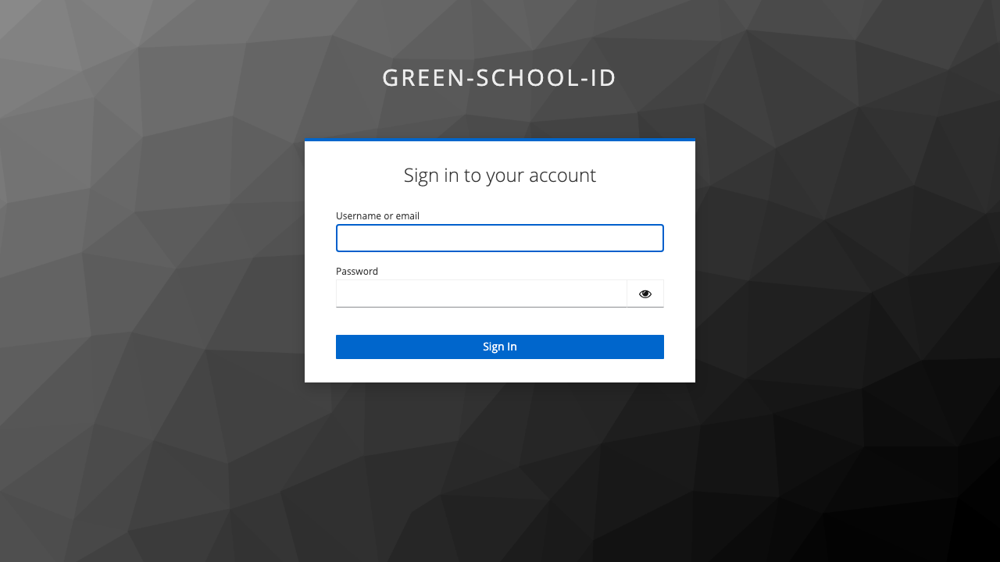
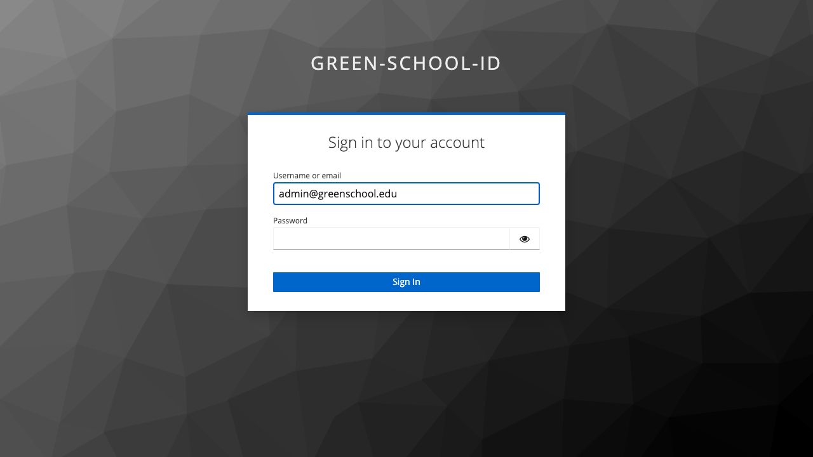
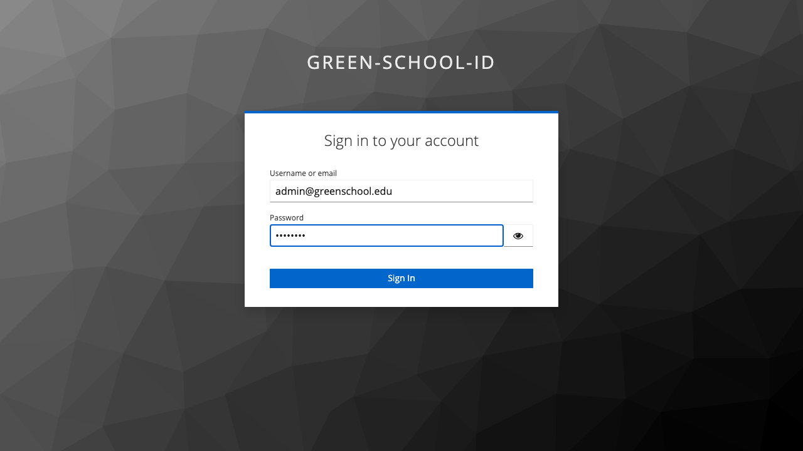
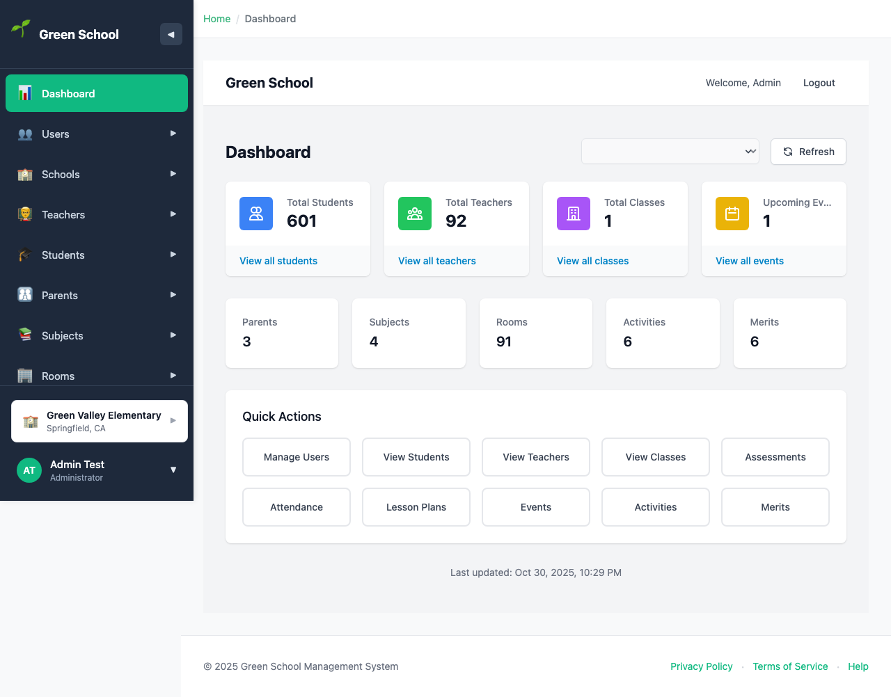
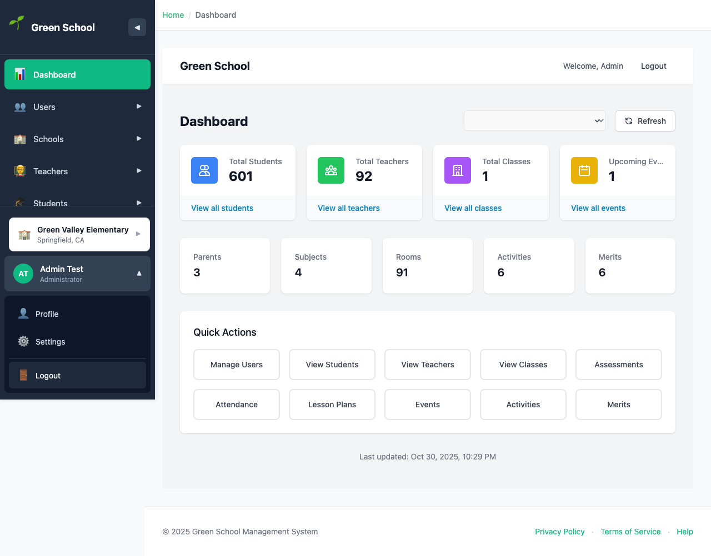

# Administrator Login Guide

## Overview

This guide walks through the login process for **Administrator** users. Administrators have full system access and can manage all features including users, schools, teachers, students, parents, and system configuration.

## Login Credentials

- **Email**: `admin@greenschool.edu`
- **Password**: `Admin123`

## Step-by-Step Login Process

### Step 1: Access the Home Page

Navigate to the application at `http://localhost:3000`

You'll see the Green School Management System home page with:
- 🌱 Green School branding
- **Sign In** button
- **View Demo Accounts** button (for credential reference)
- **API Documentation** link

---

### Step 2: Click Sign In

Click the **"Sign In"** button to proceed to the login page.

The login page displays:
- Green School branding
- **Sign in with Keycloak** button
- Information about single sign-on authentication

---

### Step 3: Keycloak Login Page

After clicking "Sign in with Keycloak", you'll be redirected to the Keycloak authentication server.

The Keycloak login page shows:
- Username or email field
- Password field
- Sign In button
- Remember me checkbox
- Forgot Password link (if configured)

---

### Step 4: Enter Email Address

Enter your administrator email: `admin@greenschool.edu`

---

### Step 5: Enter Password

Enter your password: `Admin123`

---

### Step 6: Administrator Dashboard

After successful authentication, you'll be redirected to the dashboard.

The administrator dashboard displays:
- Welcome message with your name
- Statistical overview cards
- Quick action buttons
- Recent activity feed
- System notifications

---

### Step 7: Navigation Menu

As an administrator, you have access to ALL navigation menu items:

**Available Menu Items:**
- 🏠 **Dashboard** - Overview and statistics
- 👥 **Users** - Manage all users
- 🏫 **Schools** - Manage school information
- 👨‍🏫 **Teachers** - Manage teacher accounts
- 🎓 **Students** - Manage student records
- 👪 **Parents** - Manage parent accounts
- 📚 **Subjects** - Configure subjects
- 🏢 **Rooms** - Manage facilities
- 📝 **Classes** - Class management
- 📖 **Lessons** - Lesson planning
- 📊 **Assessments** - Grade management
- 📅 **Attendance** - Attendance tracking
- 🎉 **Events** - Event calendar
- 🎭 **Activities** - Extracurricular activities
- 🏪 **Vendors** - Vendor management
- ⭐ **Merits** - Merit point system

---

### Step 8: User Menu

Click on your user avatar/button in the sidebar to access user options:

**User Menu Options:**
- 👤 **Profile** - View and edit your profile
- ⚙️ **Settings** - Application settings
- 🚪 **Logout** - Sign out securely

---

## Administrator Permissions

As an administrator, you have **FULL SYSTEM ACCESS**:

### ✅ What Administrators Can Do:
- Create, edit, and delete ALL entities
- Manage user accounts and assign roles
- Configure school settings and policies
- View all reports and statistics
- Access system configuration
- Manage teachers, students, and parents
- Create and manage classes, subjects, and rooms
- Create lesson plans and assessments
- Mark attendance and award merits
- Manage events and activities
- Configure vendor relationships
- Export data and generate reports

### ❌ No Restrictions:
- Administrators have unrestricted access to all features
- Can perform any CRUD operation on any entity
- Can access all data across all schools (in multi-tenant setup)

---

## Security Notes

🔒 **Important Security Practices:**
- Change default password after first login
- Use strong, unique passwords
- Enable two-factor authentication (if available)
- Never share administrator credentials
- Regularly review user access logs
- Log out when finished using the system
- Use secure connections (HTTPS in production)

---

## Troubleshooting

### Issue: "Invalid Credentials"
**Solution**: Verify you're using the correct email (`admin@greenschool.edu`) and password (`Admin123`). Check for typos and ensure Caps Lock is off.

### Issue: Redirected Back to Login After Signing In
**Solution**:
1. Check browser cookies are enabled
2. Verify Keycloak server is running (http://localhost:8080)
3. Check browser console for errors (F12)
4. Try clearing browser cache and cookies

### Issue: "CORS Error" in Console
**Solution**: Ensure Keycloak is properly configured:
- Web Origins: `+` or `http://localhost:3000`
- Valid Redirect URIs: `http://localhost:3000/*`
- See `/frontend/KEYCLOAK_CORS_FIX.md` for detailed instructions

### Issue: Can't See All Menu Items
**Solution**: Verify your user account has the `administrator` role assigned in Keycloak:
1. Go to Keycloak Admin Console: http://localhost:8080/admin
2. Select realm: **green-school-id**
3. Navigate to Users → Find your user
4. Check "Role Mapping" tab
5. Ensure `administrator` realm role is assigned

---

## Next Steps

After logging in as an administrator:

1. **Review Dashboard** - Check system statistics and recent activity
2. **Configure School** - Set up school information and policies
3. **Create Users** - Add teachers, students, and parents
4. **Setup Classes** - Create classes and assign teachers
5. **Configure Subjects** - Define curriculum subjects
6. **Add Rooms** - Register facilities and classrooms
7. **Create Academic Calendar** - Setup terms and holidays
8. **Configure Permissions** - Review and adjust role permissions

---

## Related Documentation

- [Teacher Login Guide](TEACHER_LOGIN.md)
- [Student Login Guide](STUDENT_LOGIN.md)
- [Parent Login Guide](PARENT_LOGIN.md)
- [Role Access Matrix](/frontend/ROLE_ACCESS_MATRIX.md)
- [Keycloak Setup Guide](/frontend/KEYCLOAK_SETUP.md)

---

## Support

For technical support or questions:
- Check the [API Documentation](http://localhost:8000/docs)
- Review [Keycloak Configuration](/frontend/KEYCLOAK_SETUP.md)
- See [Authentication Debugging](/frontend/AUTH_DEBUGGING_STEPS.md)
