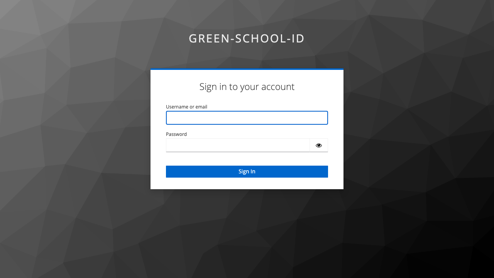

# Parent Login Guide

## Overview

This guide walks through the login process for **Parent** users. Parents have read-only access to monitor their children's academic progress including grades, attendance, class schedules, and school events.

## Login Credentials

- **Email**: `parent@greenschool.edu`
- **Password**: `Admin123`

## Step-by-Step Login Process

### Step 1: Access the Home Page

Navigate to the application at `http://localhost:3000`

---

### Step 2: Click Sign In

Click the **"Sign In"** button to proceed to the login page.

---

### Step 3: Keycloak Login Page

After clicking "Sign in with Keycloak", you'll be redirected to the Keycloak authentication server.

---

### Step 4: Enter Email Address

Enter your parent email: `parent@greenschool.edu`

---

### Step 5: Enter Password

Enter your password: `Admin123`

---

### Step 6: Parent Dashboard

After successful authentication, you'll be redirected to your parent dashboard.

The parent dashboard displays:
- Welcome message with your name
- Overview of all your children's progress
- Academic performance summary
- Attendance summary for each child
- Upcoming assessments and events
- Recent grades and teacher feedback
- Important school notifications

---

### Step 7: Navigation Menu

As a parent, you have access to view-only navigation menu items for monitoring your children:

**Available Menu Items:**
- 🏠 **Dashboard** - Overview of all children's progress
- 📝 **Classes** - View children's class schedules
- 📊 **Assessments** - View children's grades and feedback
- 📅 **Attendance** - View children's attendance records
- 🎉 **Events** - View school events calendar
- 🎭 **Activities** - View children's extracurricular activities
- ⭐ **Merits** - View children's merit points

---

### Step 8: User Menu

Click on your user avatar/button in the sidebar to access user options:

**User Menu Options:**
- 👤 **Profile** - View and edit your profile
- ⚙️ **Settings** - Personal settings
- 🚪 **Logout** - Sign out securely

---

## Parent Permissions

Parents have **READ-ONLY ACCESS** to their children's data:

### ✅ What Parents Can View:
- **Dashboard**: Overview of all children's academic progress
- **Classes**: View children's class schedules and teacher information
- **Assessments**: View children's grades, feedback, and assessment details
- **Attendance**: View children's attendance records and patterns
- **Events**: View school calendar, events, and parent-teacher conferences
- **Activities**: View children's extracurricular participation
- **Merits**: View children's merit points and achievements

### ❌ What Parents Cannot Do:
- Cannot create, edit, or delete any data
- Cannot view other students' information (except your own children)
- Cannot mark attendance or submit assignments
- Cannot create assessments or grade work
- Cannot manage users, classes, or school settings
- Cannot communicate directly through the system (use school email/phone)
- Cannot modify grades or attendance records

---

## Common Parent Tasks

### Monitor Children's Grades
1. Navigate to **Assessments**
2. View grades for all your children:
   - Child name selector (if multiple children)
   - Assessment name and type
   - Score, percentage, and grade
   - Teacher feedback
   - Due dates and submission status
   - Class average (if provided)
3. Filter by child, class, or date range
4. Identify areas needing improvement

### Check Attendance Records
1. Navigate to **Attendance**
2. View attendance for each child:
   - Total days and percentage
   - Present days (✅)
   - Absent days (❌)
   - Late arrivals (⏰)
   - Excused absences (🏥)
3. View patterns and trends
4. Get notifications for absences
5. Contact school for excused absence requests

### Review Class Schedules
1. Navigate to **Classes**
2. View each child's schedule:
   - Class names and subjects
   - Teacher names and contact info
   - Room numbers
   - Class times
   - Course descriptions
3. Plan parent-teacher meetings
4. Know when to help with homework

### View School Events
1. Navigate to **Events**
2. See upcoming events:
   - Parent-teacher conferences
   - School performances
   - Sports events
   - Assemblies
   - School holidays
   - Parent association meetings
3. Add important dates to your calendar
4. Plan attendance

### Track Merit Points and Achievements
1. Navigate to **Merits**
2. View children's achievements:
   - Total points earned
   - Points by category
   - Recent awards
   - Recognition history
   - Comparison with class average
3. Celebrate successes
4. Encourage positive behavior

### Monitor Activity Participation
1. Navigate to **Activities**
2. View children's activities:
   - Enrolled activities
   - Activity schedules
   - Supervisors/coaches
   - Performance or participation notes
3. Support extracurricular involvement

---

## Understanding the Parent Dashboard

### Children Overview
- Cards for each child showing:
  - Name and grade level
  - Current GPA
  - Attendance percentage
  - Recent merit points
  - Upcoming assessments

### Academic Performance Summary
- Overall GPA trends
- Grade distribution by subject
- Comparison with previous terms
- Areas of strength
- Areas needing attention

### Attendance Alerts
- Recent absences
- Late arrivals
- Patterns requiring attention
- Excused vs. unexcused absences

### Upcoming Items
- Tests and quizzes
- Assignment due dates
- Parent-teacher conferences
- School events requiring parent attendance

### Recent Activity Feed
- New grades posted
- Teacher feedback received
- Merit points awarded
- Attendance updates
- School announcements

---

## Tips for Parents

### Active Monitoring
- Check dashboard 2-3 times per week
- Review new grades when posted
- Monitor attendance regularly
- Stay informed about upcoming events
- Respond to teacher communications promptly

### Supporting Academic Success
- Discuss grades with your children
- Celebrate achievements and merit points
- Address concerning patterns early
- Contact teachers when help is needed
- Establish homework routines
- Provide quiet study space
- Encourage reading and learning

### Communication with School
- Note teacher names and contact information
- Attend parent-teacher conferences
- Respond to school communications
- Email teachers with specific concerns
- Join parent association or committees
- Participate in school events

### Attendance Management
- Ensure children arrive on time
- Notify school of planned absences
- Provide documentation for medical absences
- Address attendance concerns promptly
- Understand school attendance policy
- Request homework for extended absences

### Using the System Effectively
- Log in regularly to stay informed
- Compare multiple children's progress
- Track trends over time
- Set up email notifications (if available)
- Bookmark important pages
- Keep login credentials secure

---

## Multiple Children

If you have multiple children enrolled:

### Switching Between Children
- Use child selector dropdown (if available)
- Dashboard shows all children's overview
- Each section allows filtering by child
- Compare progress across children

### Individual Monitoring
- Review each child's dashboard separately
- Track unique needs and strengths
- Adjust support based on individual progress
- Celebrate each child's achievements

### Time Management
- Schedule regular check-ins for each child
- Prioritize children with concerning patterns
- Balance attention across all children
- Use dashboard alerts to identify urgent items

---

## Privacy and Confidentiality

🔒 **Important Notes:**
- Only you and authorized school staff can view your children's information
- Keep login credentials secure and private
- Do not share account access with children
- Other parents cannot see your children's data
- Your children cannot access the parent view
- All data is protected under FERPA/GDPR regulations
- Report any privacy concerns to school administration

---

## Troubleshooting

### Issue: Not Seeing All My Children
**Solution**:
- Contact school office to verify parent account setup
- Confirm all children are linked to your parent account
- Check that children are enrolled for current term
- Verify your contact information is current

### Issue: Grades Not Appearing
**Solution**:
- Teachers may not have posted grades yet
- Check correct term/quarter is selected
- Verify child is enrolled in that class
- Refresh the page
- Contact teacher if grades are expected

### Issue: Attendance Seems Incorrect
**Solution**:
- Attendance is marked by teachers daily
- May take 24 hours to update
- Contact teacher or school office for discrepancies
- Provide documentation for excused absences
- Request attendance audit if seriously incorrect

### Issue: Can't Access Child's Information
**Solution**:
- Verify you're logged in with parent account
- Check your parent profile is properly configured
- Ensure child is linked to your account
- Contact school administrator for account issues

### Issue: Dashboard Not Loading
**Solution**:
- Check internet connection
- Clear browser cache and cookies
- Try different browser
- Log out and log back in
- Contact school IT support if issue persists

---

## When to Contact Teachers

### Academic Concerns
- Consistent low grades
- Sudden grade drops
- Missing assignments
- Difficulty understanding material
- Need for additional support

### Behavioral Issues
- Discipline concerns
- Social challenges
- Changes in behavior
- Attendance problems
- Classroom participation

### Positive Communications
- Thank teachers for good work
- Acknowledge student improvements
- Share helpful information about your child
- Express appreciation for extra help
- Participate in classroom activities

---

## Parent-Teacher Conferences

### Before the Conference
- Review your child's grades and attendance
- Note specific questions or concerns
- Discuss conference with your child
- Bring grade reports from dashboard
- Schedule adequate time

### During the Conference
- Ask about academic progress
- Discuss attendance and behavior
- Request specific improvement strategies
- Share home observations
- Set goals and follow-up plans

### After the Conference
- Discuss outcomes with your child
- Implement agreed-upon strategies
- Follow up on action items
- Monitor progress
- Thank teacher for their time

---

## Next Steps

After logging in as a parent:

1. **Review Dashboard** - Check all children's progress overview
2. **Check Grades** - Review recent assessment results for each child
3. **View Attendance** - Monitor attendance records
4. **Review Schedules** - Familiarize yourself with class times and teachers
5. **Check Events** - Note upcoming parent conferences and events
6. **View Merit Points** - Celebrate achievements
7. **Identify Concerns** - Note any areas needing attention
8. **Plan Communication** - Contact teachers if needed

---

## Related Documentation

- [Administrator Login Guide](ADMINISTRATOR_LOGIN.md)
- [Teacher Login Guide](TEACHER_LOGIN.md)
- [Student Login Guide](STUDENT_LOGIN.md)
- [Role Access Matrix](/frontend/ROLE_ACCESS_MATRIX.md)

---

## School Communication

### Contact Methods
- Use school email addresses
- Call school office for urgent matters
- Email teachers for academic questions
- Attend scheduled meetings and conferences
- Check school website for updates
- Join parent communication groups

### Emergency Contacts
- Keep emergency contact information current
- Provide multiple contact numbers
- Respond to school calls promptly
- Notify school of contact changes
- Provide authorized pickup list

---

## Support

For questions or technical issues:
- Contact school office: [school phone/email]
- Teacher email addresses in Classes section
- School IT support for technical problems
- School administration for account issues
- Check school website for FAQs

---

## Best Practices

✅ **Do:**
- Log in regularly (2-3 times per week minimum)
- Celebrate your child's successes
- Address concerns early
- Communicate with teachers
- Attend school events
- Support homework and study
- Keep login secure

❌ **Don't:**
- Share account credentials
- Wait until problems are severe
- Compare your child to others publicly
- Ignore attendance issues
- Miss parent-teacher conferences
- Leave messages unread
- Use child's account instead

---

## Additional Resources

- School handbook and policies
- Academic calendar
- Parent association information
- Volunteer opportunities
- Community resources
- Tutoring services
- School counseling services
