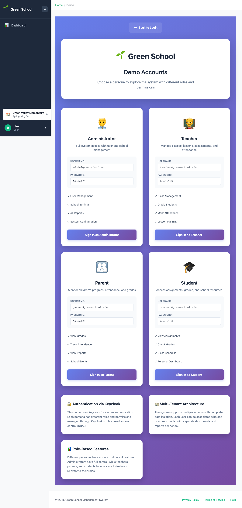

# Login Documentation

## Overview

This directory contains comprehensive login guides for all user types in the Green School Management System. Each guide includes step-by-step instructions with screenshots captured using Playwright automated testing.

## Available Login Guides

### 👨‍💼 [Administrator Login](ADMINISTRATOR_LOGIN.md)
**Full system access** for school administrators.
- **Credentials**: `admin@greenschool.edu` / `Admin123`
- **Access Level**: Complete control of all features
- **Key Features**: User management, school configuration, reports
- **Menu Items**: All 15 navigation items

### 👨‍🏫 [Teacher Login](TEACHER_LOGIN.md)
**Classroom management** for teachers.
- **Credentials**: `teacher@greenschool.edu` / `Admin123`
- **Access Level**: Classroom and student management
- **Key Features**: Lesson planning, grading, attendance
- **Menu Items**: 12 navigation items

### 🎓 [Student Login](STUDENT_LOGIN.md)
**Read-only access** for students to view their own data.
- **Credentials**: `student@greenschool.edu` / `Admin123`
- **Access Level**: View own academic information
- **Key Features**: Grades, attendance, schedule, events
- **Menu Items**: 7 navigation items

### 👪 [Parent Login](PARENT_LOGIN.md)
**Read-only monitoring** for parents to track children's progress.
- **Credentials**: `parent@greenschool.edu` / `Admin123`
- **Access Level**: View children's academic information
- **Key Features**: Grades, attendance, communication
- **Menu Items**: 7 navigation items

---

## Quick Start

1. **Navigate to**: http://localhost:3000
2. **Click**: "Sign In" button
3. **Click**: "Sign in with Keycloak"
4. **Enter**: Your email and password from the credentials above
5. **Explore**: Dashboard and available features

---

## Demo Accounts

### View All Demo Accounts
Navigate to http://localhost:3000/demo to see all available demo accounts with credentials.



---

## Role Comparison

| Feature | Administrator | Teacher | Student | Parent |
|---------|--------------|---------|---------|--------|
| **Dashboard** | ✅ Full overview | ✅ Class overview | ✅ Personal | ✅ Children |
| **Users** | ✅ Full CRUD | ❌ | ❌ | ❌ |
| **Schools** | ✅ Full CRUD | ❌ | ❌ | ❌ |
| **Teachers** | ✅ Manage | ❌ | ❌ | ❌ |
| **Students** | ✅ Full CRUD | ✅ View own | ❌ | ❌ |
| **Parents** | ✅ Full CRUD | ✅ View | ❌ | ❌ |
| **Subjects** | ✅ Full CRUD | ✅ View | ❌ | ❌ |
| **Rooms** | ✅ Full CRUD | ✅ View | ❌ | ❌ |
| **Classes** | ✅ Full CRUD | ✅ Manage own | ✅ View own | ✅ View children's |
| **Lessons** | ✅ Full CRUD | ✅ Create/Edit | ❌ | ❌ |
| **Assessments** | ✅ Full CRUD | ✅ Grade own | ✅ View own | ✅ View children's |
| **Attendance** | ✅ Full CRUD | ✅ Mark own classes | ✅ View own | ✅ View children's |
| **Events** | ✅ Full CRUD | ✅ View/Create | ✅ View | ✅ View |
| **Activities** | ✅ Full CRUD | ✅ Manage assigned | ✅ View | ✅ View children's |
| **Vendors** | ✅ Full CRUD | ❌ | ❌ | ❌ |
| **Merits** | ✅ Full CRUD | ✅ Award | ✅ View own | ✅ View children's |

Legend:
- ✅ **Full CRUD**: Create, Read, Update, Delete access
- ✅ **Manage**: Create and edit access for assigned items
- ✅ **View**: Read-only access
- ❌ **No Access**: Cannot view or access

---

## Authentication Flow

All users follow the same authentication flow:

```
1. Home Page (localhost:3000)
   ↓
2. Click "Sign In"
   ↓
3. Login Page (Application)
   ↓
4. Click "Sign in with Keycloak"
   ↓
5. Keycloak Login (localhost:8080)
   ↓
6. Enter Credentials
   ↓
7. Keycloak Authenticates
   ↓
8. Redirect to Dashboard
   ↓
9. Role-Based Navigation Displayed
```

---

## Technology Stack

### Authentication
- **Provider**: Keycloak SSO (localhost:8080)
- **Protocol**: OpenID Connect (OIDC)
- **Flow**: Authorization Code Flow with PKCE
- **Realm**: green-school-id
- **Client**: green-school-id

### Session Management
- **Tokens**: JWT (JSON Web Tokens)
- **Storage**: Browser sessionStorage
- **Refresh**: Automatic (60-second interval)
- **Timeout**: Configurable in Keycloak

### Security Features
- PKCE (Proof Key for Code Exchange)
- HTTPS in production
- CORS protection
- Role-based access control (RBAC)
- Token expiration and refresh
- Secure logout with session termination

---

## Screenshots

All screenshots are stored in the `screenshots/` directory:

### Administrator Screenshots (8 images)
- `admin-01-home.png` - Home page
- `admin-02-login-page.png` - Login page
- `admin-03-keycloak-login.png` - Keycloak login
- `admin-04-enter-email.png` - Email entry
- `admin-05-enter-password.png` - Password entry
- `admin-06-dashboard.png` - Dashboard view
- `admin-07-navigation.png` - Navigation menu
- `admin-08-user-menu.png` - User menu dropdown

### Teacher Screenshots (8 images)
- `teacher-01-home.png` through `teacher-08-user-menu.png`

### Student Screenshots (8 images)
- `student-01-home.png` through `student-08-user-menu.png`

### Parent Screenshots (8 images)
- `parent-01-home.png` through `parent-08-user-menu.png`

### Demo Page
- `demo-page.png` - Demo accounts page

**Total**: 33 screenshots

---

## Testing

Screenshots were automatically generated using Playwright E2E testing:

```bash
# Run login guide tests
cd frontend
npx playwright test login-guide.spec.ts

# View test results
npx playwright show-report
```

### Test Coverage
- ✅ All 4 user types login flows
- ✅ Complete authentication journey
- ✅ Dashboard verification
- ✅ Navigation menu verification
- ✅ User menu functionality
- ✅ Demo page capture

Test file location: `/frontend/tests/e2e/login-guide.spec.ts`

---

## Common Issues

### CORS Errors
**Symptom**: "Access to XMLHttpRequest blocked by CORS policy"
**Solution**: Configure Keycloak client settings:
- Web Origins: `+` or `http://localhost:3000`
- Valid Redirect URIs: `http://localhost:3000/*`
- See [Keycloak CORS Fix](/frontend/KEYCLOAK_CORS_FIX.md)

### Invalid Credentials
**Symptom**: "Invalid username or password"
**Solution**:
- Verify correct email and password
- Check Caps Lock is off
- Try password reset (if configured)
- Contact administrator

### Can't See Expected Features
**Symptom**: Missing navigation menu items
**Solution**:
- Verify correct role is assigned in Keycloak
- Log out and log back in
- Clear browser cache
- Check role assignments with administrator

### Session Expired
**Symptom**: Redirected to login after inactivity
**Solution**:
- Sessions expire based on Keycloak configuration
- Log in again to start new session
- Adjust session timeout in Keycloak settings

---

## Security Best Practices

### For All Users
- ✅ Use strong, unique passwords
- ✅ Never share login credentials
- ✅ Log out when finished
- ✅ Use secure connections (HTTPS in production)
- ✅ Report suspicious activity
- ❌ Don't save passwords in unsecured locations
- ❌ Don't use shared computers without logging out
- ❌ Don't share screens with credentials visible

### For Administrators
- ✅ Change default passwords immediately
- ✅ Enable two-factor authentication (if available)
- ✅ Review user access regularly
- ✅ Monitor authentication logs
- ✅ Enforce password policies
- ✅ Regular security audits

### For Teachers
- ✅ Keep student information confidential
- ✅ Lock devices when away
- ✅ Use school-provided email
- ✅ Report data breaches immediately
- ✅ Follow FERPA/GDPR guidelines

### For Students and Parents
- ✅ Keep credentials private
- ✅ Log out on shared devices
- ✅ Report access issues
- ✅ Don't share account access
- ✅ Notify school of security concerns

---

## Support Resources

### Documentation
- [Role Access Matrix](/frontend/ROLE_ACCESS_MATRIX.md)
- [Keycloak Setup](/frontend/KEYCLOAK_SETUP.md)
- [Keycloak CORS Fix](/frontend/KEYCLOAK_CORS_FIX.md)
- [Authentication Debugging](/frontend/AUTH_DEBUGGING_STEPS.md)
- [Logout Configuration](/frontend/LOGOUT_CONFIGURATION.md)

### Technical Resources
- **API Documentation**: http://localhost:8000/docs
- **Keycloak Admin**: http://localhost:8080/admin
- **Frontend**: http://localhost:3000
- **Backend**: http://localhost:8000

### Getting Help
- **Technical Issues**: Contact school IT support
- **Account Problems**: Contact school administrator
- **Academic Questions**: Contact teachers directly
- **System Bugs**: Report to development team

---

## Maintenance

### Updating Screenshots
To regenerate all screenshots after UI changes:

```bash
cd frontend
npx playwright test login-guide.spec.ts --update-snapshots
```

### Adding New User Types
If new user types are added:
1. Add credentials to test data
2. Create test flow in `login-guide.spec.ts`
3. Run tests to generate screenshots
4. Create markdown guide following existing pattern
5. Update this README with new user type

### Verifying Authentication
Regular authentication testing:
```bash
# Run all authentication tests
cd frontend
npx playwright test login-guide.spec.ts

# Check test results
npx playwright show-report
```

---

## Development

### Environment
- **Development**: http://localhost:3000
- **Staging**: (Configure as needed)
- **Production**: (Configure as needed)

### Keycloak Configuration
- **Realm**: green-school-id
- **Client ID**: green-school-id
- **Client Protocol**: openid-connect
- **Access Type**: public
- **Standard Flow**: Enabled
- **Direct Access Grants**: Enabled

### User Creation
To create additional demo users:
1. Access Keycloak Admin Console
2. Navigate to Users
3. Create user with appropriate realm roles
4. Set temporary password
5. Update documentation

---

## Changelog

### Version 1.0 (2025-10-30)
- ✅ Initial login guide creation
- ✅ Automated screenshot generation with Playwright
- ✅ Complete guides for all 4 user types
- ✅ 33 total screenshots captured
- ✅ Role comparison matrix
- ✅ Troubleshooting documentation
- ✅ Security best practices

---

## License

Green School Management System
© 2025 All Rights Reserved

---

## Contact

For questions or feedback about this documentation:
- Create an issue in the project repository
- Contact the development team
- Refer to main project README

---

**Last Updated**: October 30, 2025
**Documentation Version**: 1.0
**System Version**: Compatible with Green School v1.0
