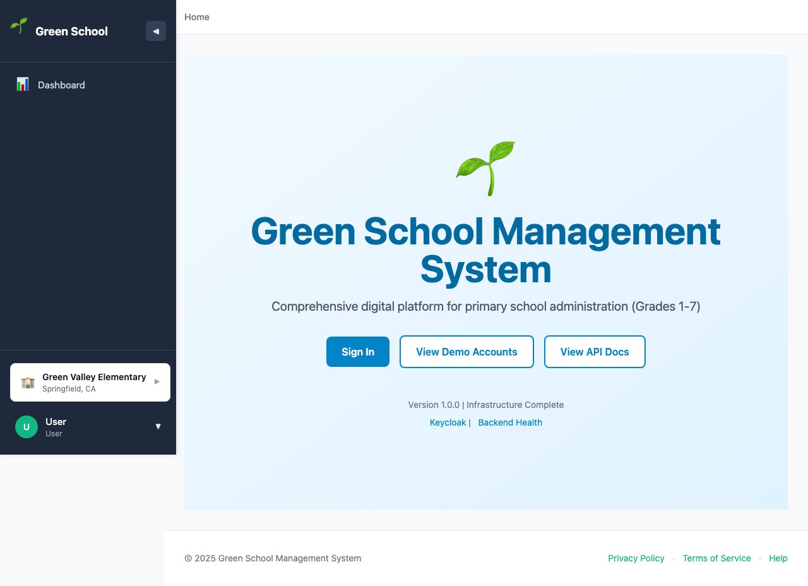
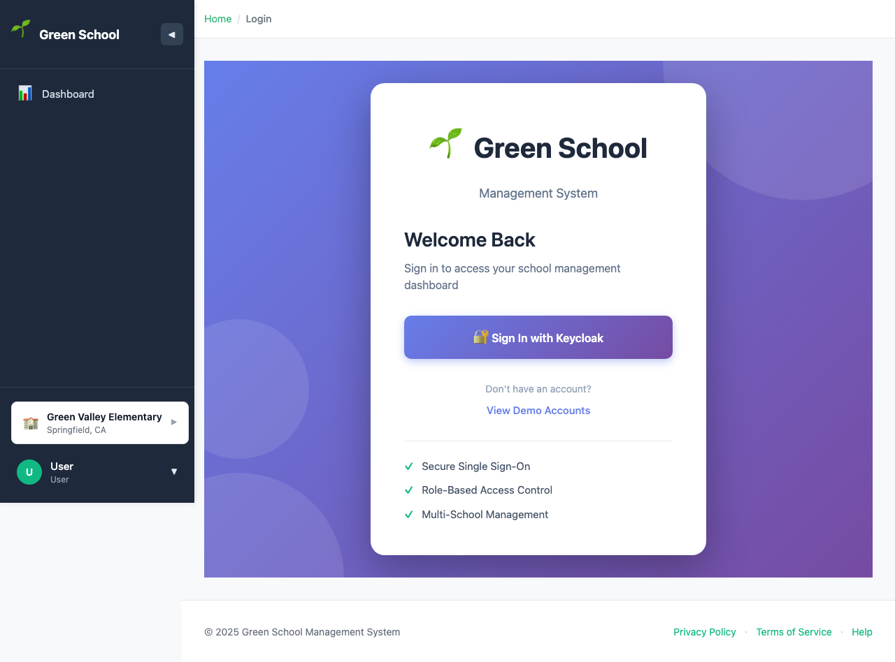
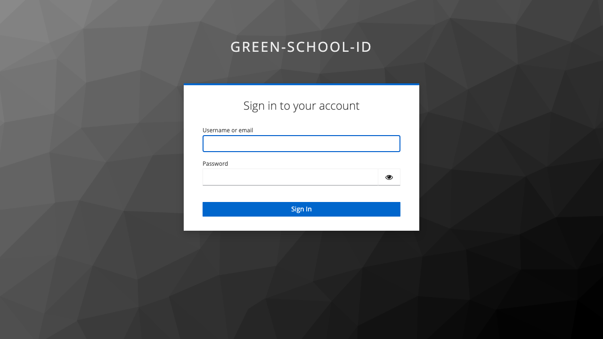
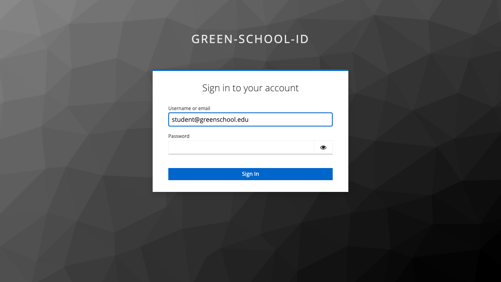
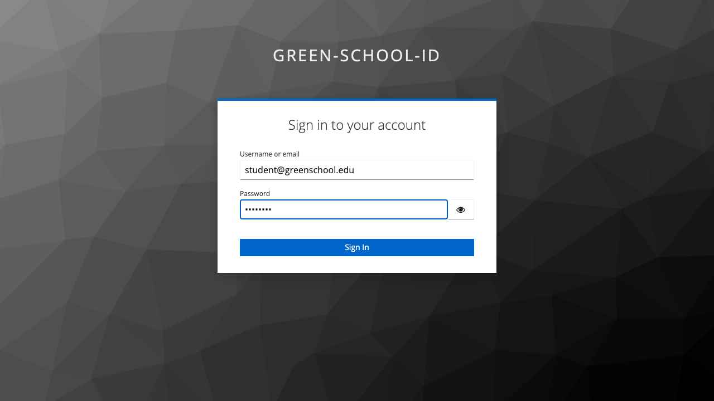
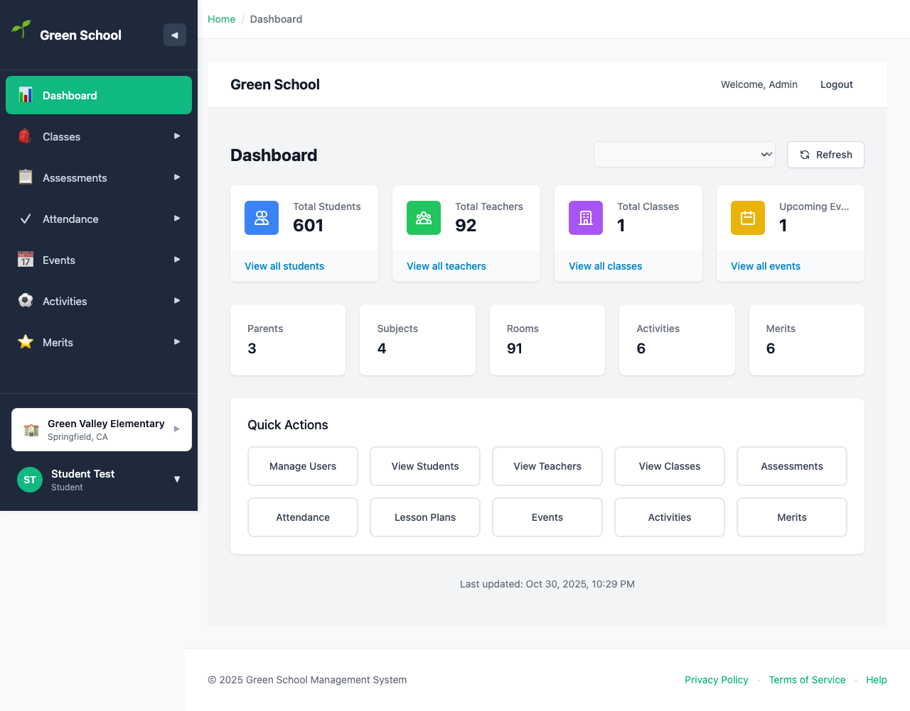
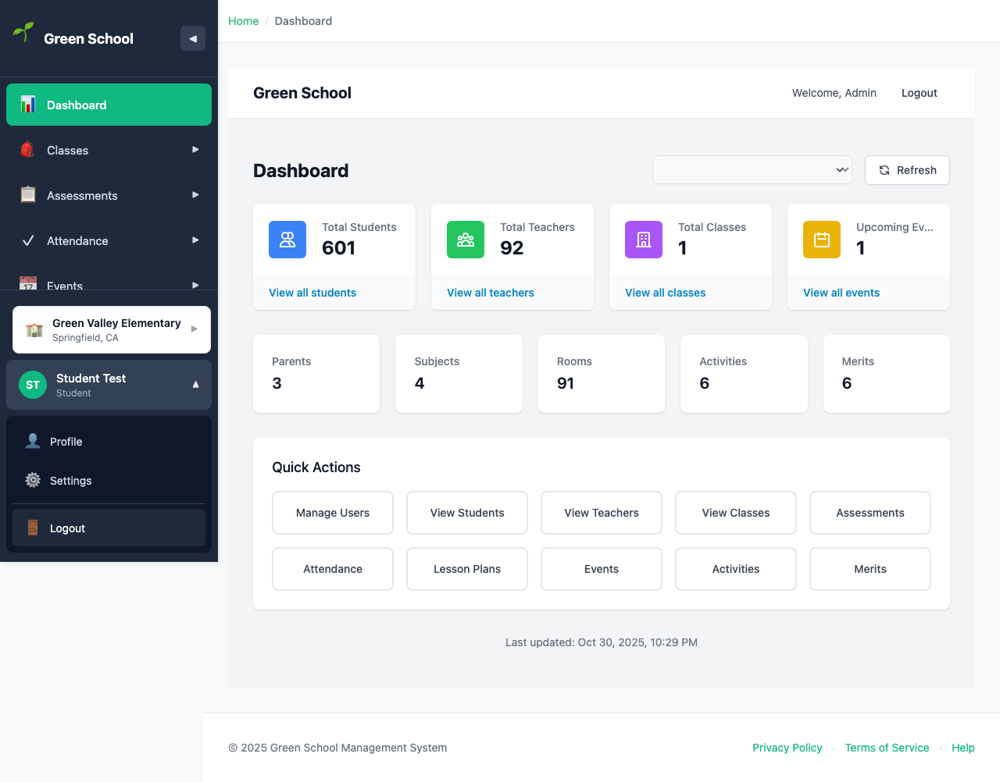

# Student Login Guide

## Overview

This guide walks through the login process for **Student** users. Students have read-only access to view their own academic information including grades, attendance, class schedules, and school events.

## Login Credentials

- **Email**: `student@greenschool.edu`
- **Password**: `Admin123`

## Step-by-Step Login Process

### Step 1: Access the Home Page

Navigate to the application at `http://localhost:3000`

---

### Step 2: Click Sign In

Click the **"Sign In"** button to proceed to the login page.

---

### Step 3: Keycloak Login Page

After clicking "Sign in with Keycloak", you'll be redirected to the Keycloak authentication server.

---

### Step 4: Enter Email Address

Enter your student email: `student@greenschool.edu`

---

### Step 5: Enter Password

Enter your password: `Admin123`

---

### Step 6: Student Dashboard

After successful authentication, you'll be redirected to your personal dashboard.

The student dashboard displays:
- Welcome message with your name
- Current GPA and grade summary
- Attendance summary (present, absent, late)
- Upcoming assessments and due dates
- Recent grades and feedback
- Class schedule for today
- School announcements

---

### Step 7: Navigation Menu

As a student, you have access to view-only navigation menu items:

**Available Menu Items:**
- 🏠 **Dashboard** - Your personal academic overview
- 📝 **Classes** - View your class schedule
- 📊 **Assessments** - View your grades and feedback
- 📅 **Attendance** - View your attendance records
- 🎉 **Events** - View school events calendar
- 🎭 **Activities** - View available extracurricular activities
- ⭐ **Merits** - View your merit points and leaderboard

---

### Step 8: User Menu

Click on your user avatar/button in the sidebar to access user options:

**User Menu Options:**
- 👤 **Profile** - View your profile
- ⚙️ **Settings** - Personal settings
- 🚪 **Logout** - Sign out securely

---

## Student Permissions

Students have **READ-ONLY ACCESS** to their own data:

### ✅ What Students Can View:
- **Dashboard**: Personal academic overview with GPA, attendance summary
- **Classes**: View enrolled classes, schedules, and teacher information
- **Assessments**: View own grades, feedback, and assessment details
- **Attendance**: View own attendance records and history
- **Events**: View school calendar and upcoming events
- **Activities**: View extracurricular activities and enrollment status
- **Merits**: View merit points earned and class leaderboard

### ❌ What Students Cannot Do:
- Cannot create, edit, or delete any data
- Cannot view other students' grades or information
- Cannot mark attendance
- Cannot create assessments or lesson plans
- Cannot access teacher or parent features
- Cannot manage users, classes, or school settings
- Cannot view or contact other students directly
- Cannot modify their own grades or attendance

---

## Common Student Tasks

### Check Your Grades
1. Navigate to **Assessments** from the sidebar
2. View list of all your assessments
3. Click on an assessment to see:
   - Your score and percentage
   - Teacher feedback
   - Assignment details
   - Due dates
   - Class average (if enabled)

### View Your Attendance
1. Navigate to **Attendance**
2. View your attendance history:
   - Present days (✅)
   - Absent days (❌)
   - Late arrivals (⏰)
   - Excused absences (🏥)
3. Check attendance percentage
4. View attendance by class or date range

### Check Your Class Schedule
1. Navigate to **Classes**
2. View your enrolled classes:
   - Class name and code
   - Teacher name
   - Room number
   - Schedule (days and times)
   - Subject information

### View School Events
1. Navigate to **Events**
2. Browse upcoming events:
   - Assemblies
   - Sports events
   - Performances
   - Parent-teacher conferences
   - School holidays
3. Filter by event type or date

### View Your Merit Points
1. Navigate to **Merits**
2. View:
   - Total points earned
   - Points by category (Academic, Behavior, Participation)
   - Recent merit awards
   - Class leaderboard (your ranking)
   - Historical point trends

### Check Activity Participation
1. Navigate to **Activities**
2. View available extracurricular activities:
   - Activity name and description
   - Schedule and location
   - Supervisor/coach
   - Your enrollment status

---

## Understanding Your Dashboard

### GPA Card
- Shows your current grade point average
- Color-coded (green for good, yellow for average, red for needs improvement)
- Updated when teachers post new grades

### Attendance Summary
- Total days: School days in the current term
- Present: Days you attended all classes
- Absent: Days you were absent
- Late: Days you arrived late
- Attendance percentage

### Upcoming Assessments
- List of tests, quizzes, and assignments
- Due dates highlighted
- Status indicators:
  - 🔴 Overdue
  - 🟡 Due soon (within 3 days)
  - 🟢 Upcoming
  - ✅ Submitted/Completed

### Recent Grades
- Your latest assessment results
- Shows score, percentage, and grade
- Click to view detailed feedback

### Today's Schedule
- Classes you have today
- Room numbers and times
- Teacher names

---

## Tips for Students

### Staying Organized
- Check your dashboard daily for updates
- Review upcoming assessments regularly
- Monitor your attendance percentage
- Set personal academic goals
- Keep track of assignment due dates

### Academic Success
- Review teacher feedback on assessments
- Identify subjects where you need improvement
- Celebrate achievements (merit points!)
- Communicate with teachers if you need help
- Ask your parents to review your progress

### Using Merit Points
- Merit points recognize your achievements
- Earn points for:
  - Academic excellence
  - Good behavior
  - Active participation
  - Helping others
  - Attendance
- Check leaderboard to see your ranking
- Points may be redeemed for rewards (check with school)

### Event Participation
- Stay informed about school events
- Mark important events on your calendar
- Encourage parents to attend parent events
- Participate in school activities
- Check for event updates regularly

---

## Privacy and Safety

🔒 **Important Notes:**
- Your login credentials are private - never share them
- You can only see your own grades and information
- Other students cannot see your academic data
- Teachers and parents can view your information
- Report any issues to teachers or administrators
- Log out when using shared computers

---

## Troubleshooting

### Issue: Can't See My Grades
**Solution**:
- Verify your teacher has posted grades
- Check you're looking at the correct term/quarter
- Try refreshing the page
- Contact your teacher if grades should be visible

### Issue: Attendance Looks Wrong
**Solution**:
- Attendance is marked by teachers daily
- Check with your teacher if you see an error
- Excused absences should be marked with a note
- Ask parent to contact school for attendance corrections

### Issue: Classes Not Showing
**Solution**:
- Verify you're enrolled in classes for current term
- Check with school office or counselor
- Refresh the page
- Contact administrator if issue persists

### Issue: Dashboard Not Loading
**Solution**:
- Check your internet connection
- Try clearing browser cache
- Log out and log back in
- Try a different browser
- Contact school IT support

---

## Getting Help

### Academic Questions
- Talk to your teachers during class or office hours
- Ask parents to contact teachers
- Check assignment instructions carefully
- Use provided study resources

### Technical Issues
- Ask parents for help with login issues
- Contact school office for password resets
- Report system errors to teachers
- Check with school IT support

### School Information
- Ask teachers about events and activities
- Check school website for announcements
- Review school calendar regularly
- Contact school office for general questions

---

## Next Steps

After logging in as a student:

1. **Review Dashboard** - Check your academic overview
2. **Check Grades** - Review recent assessment results
3. **View Attendance** - Monitor your attendance record
4. **Review Schedule** - Confirm your class schedule
5. **Check Events** - See upcoming school activities
6. **View Merit Points** - See your achievement recognition
7. **Set Goals** - Plan how to improve your grades

---

## Related Documentation

- [Administrator Login Guide](ADMINISTRATOR_LOGIN.md)
- [Teacher Login Guide](TEACHER_LOGIN.md)
- [Parent Login Guide](PARENT_LOGIN.md)
- [Role Access Matrix](/frontend/ROLE_ACCESS_MATRIX.md)

---

## Parent Communication

Encourage your parents to:
- Create their own parent account to monitor your progress
- Review your grades and attendance regularly
- Communicate with teachers if you need help
- Attend parent-teacher conferences
- Support your academic goals

---

## Support

For questions or issues:
- Talk to your teachers
- Ask your parents for help
- Contact school office
- Report technical issues to school IT
