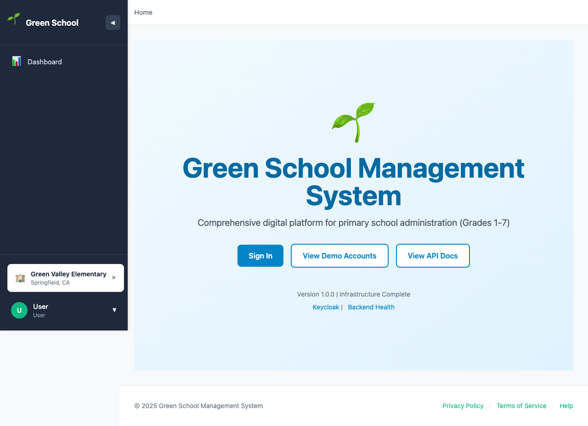
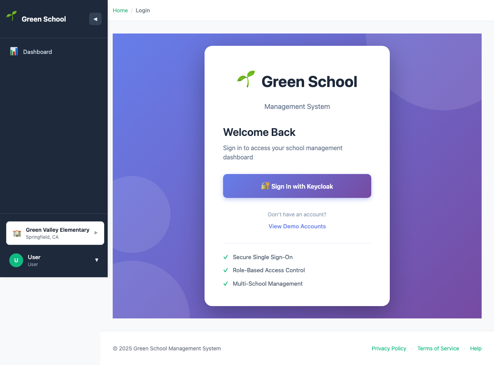
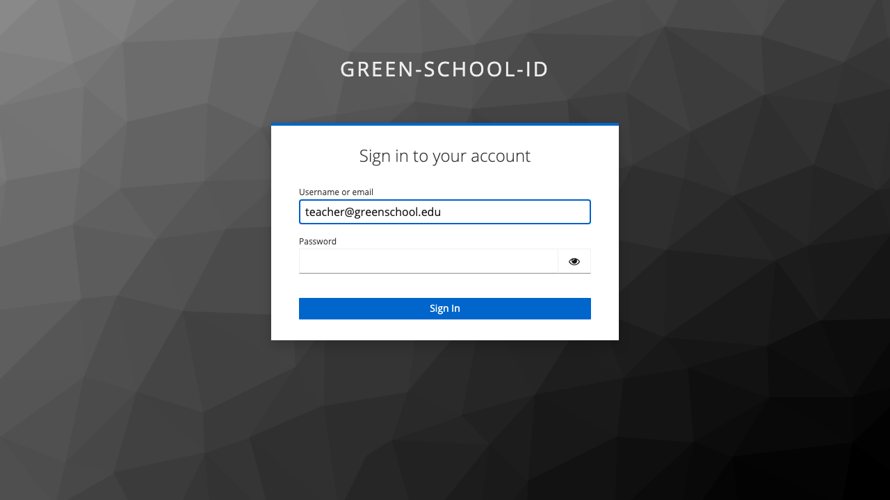
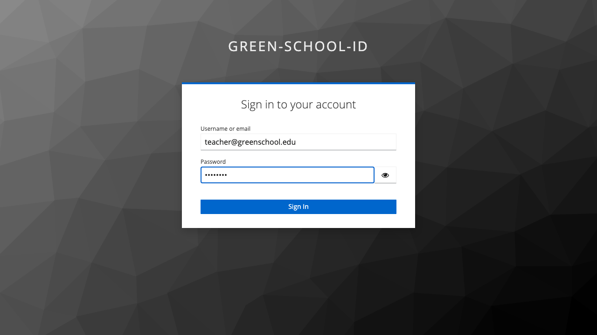
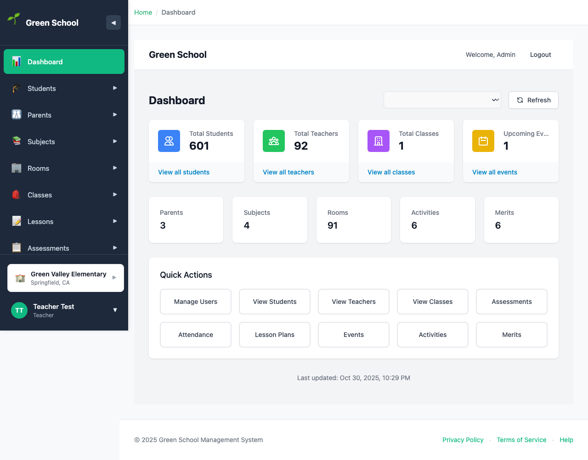
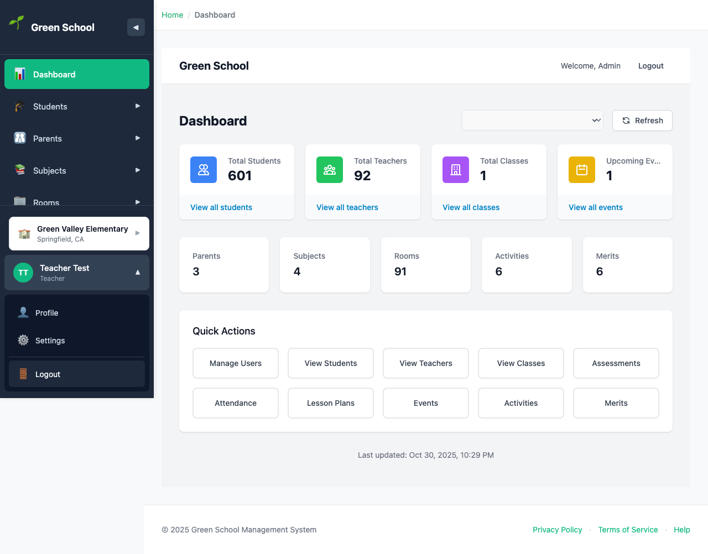

# Teacher Login Guide

## Overview

This guide walks through the login process for **Teacher** users. Teachers have access to classroom management features including lesson planning, assessments, attendance, and communication with parents.

## Login Credentials

- **Email**: `teacher@greenschool.edu`
- **Password**: `Admin123`

## Step-by-Step Login Process

### Step 1: Access the Home Page

Navigate to the application at `http://localhost:3000`

---

### Step 2: Click Sign In

Click the **"Sign In"** button to proceed to the login page.

---

### Step 3: Keycloak Login Page

After clicking "Sign in with Keycloak", you'll be redirected to the Keycloak authentication server.

---

### Step 4: Enter Email Address

Enter your teacher email: `teacher@greenschool.edu`

---

### Step 5: Enter Password

Enter your password: `Admin123`

---

### Step 6: Teacher Dashboard

After successful authentication, you'll be redirected to the teacher dashboard.

The teacher dashboard displays:
- Welcome message with your name
- Your class statistics
- Today's schedule
- Pending tasks (grading, attendance)
- Recent student activity
- Upcoming lessons and assessments

---

### Step 7: Navigation Menu

As a teacher, you have access to classroom-focused navigation menu items:

**Available Menu Items:**
- 🏠 **Dashboard** - Your teaching overview
- 🎓 **Students** - View and manage your students
- 👪 **Parents** - Communicate with parents
- 📚 **Subjects** - View subject information
- 🏢 **Rooms** - View classroom assignments
- 📝 **Classes** - Manage your assigned classes
- 📖 **Lessons** - Create and manage lesson plans
- 📊 **Assessments** - Create and grade assessments
- 📅 **Attendance** - Mark daily attendance
- 🎉 **Events** - View and create school events
- 🎭 **Activities** - Manage assigned activities
- ⭐ **Merits** - Award merit points to students

---

### Step 8: User Menu

Click on your user avatar/button in the sidebar to access user options:

**User Menu Options:**
- 👤 **Profile** - View and edit your profile
- ⚙️ **Settings** - Personal settings
- 🚪 **Logout** - Sign out securely

---

## Teacher Permissions

Teachers have **CLASSROOM MANAGEMENT ACCESS**:

### ✅ What Teachers Can Do:
- **Students**: View students in their classes (read-only, limited editing)
- **Parents**: View parent contact information and communicate
- **Subjects**: View subject information
- **Rooms**: View classroom assignments
- **Classes**: View and manage their assigned classes only
- **Lessons**: Create, edit, and delete lesson plans for their classes
- **Assessments**: Create, grade, and manage assessments for their classes
- **Attendance**: Mark attendance for their classes
- **Events**: View all events, create new events
- **Activities**: View all activities, manage assigned activities
- **Merits**: Award merit points to students in their classes

### ❌ What Teachers Cannot Do:
- Cannot manage users or schools
- Cannot access system configuration
- Cannot view other teachers' classes (unless shared)
- Cannot modify school settings
- Cannot delete students or parents
- Cannot create or modify subjects
- Cannot manage rooms or facilities
- Cannot access admin-only features
- Cannot view vendor information

---

## Common Teacher Tasks

### Create a Lesson Plan
1. Navigate to **Lessons** from the sidebar
2. Click **"Create Lesson"**
3. Fill in:
   - Title and description
   - Class and subject
   - Scheduled date and duration
   - Learning objectives
   - Materials needed
   - Activities and assessments
4. Click **"Save Lesson"**

### Grade an Assessment
1. Navigate to **Assessments**
2. Find the assessment to grade
3. Click **"Grade"** or the assessment name
4. Enter scores for each student
5. Add feedback (optional)
6. Click **"Save Grades"**

### Mark Attendance
1. Navigate to **Attendance**
2. Select your class and date
3. Mark each student as:
   - ✅ Present
   - ❌ Absent
   - ⏰ Late
   - 🏥 Excused
4. Add notes if needed
5. Click **"Save Attendance"**

### Award Merit Points
1. Navigate to **Merits**
2. Click **"Award Merit"**
3. Select student(s)
4. Choose category (Academic, Behavior, Participation, etc.)
5. Enter points and reason
6. Click **"Award Points"**

---

## Security Notes

🔒 **Important Security Practices:**
- Use strong passwords
- Log out when leaving your device unattended
- Never share your credentials with students or parents
- Report suspicious activity to administrators
- Regularly review your class rosters
- Keep student information confidential (GDPR/FERPA compliance)

---

## Troubleshooting

### Issue: Can't See All My Classes
**Solution**: Contact your administrator to verify:
- You're assigned to the correct classes in the system
- Your teacher profile is properly configured
- Class assignments are active for the current term

### Issue: Can't Grade Assessments
**Solution**:
- Verify you're the teacher assigned to that class
- Check that the assessment status is "pending" or "active"
- Ensure you have grading permissions for that subject
- Contact administrator if issue persists

### Issue: Can't Mark Attendance
**Solution**:
- Verify it's a class you're assigned to
- Check the date is within the current academic term
- Ensure attendance hasn't already been submitted
- Try refreshing the page

### Issue: Students Not Appearing in Class List
**Solution**:
- Verify enrollment records with administrator
- Check you're viewing the correct class and term
- Refresh the page to update student roster
- Contact administrator to verify student assignments

---

## Tips for Effective Use

### Lesson Planning
- Plan lessons at least one week in advance
- Include detailed learning objectives
- Attach resources and materials
- Link to related assessments
- Use templates for recurring lesson types

### Assessment Management
- Set clear grading rubrics before creating assessments
- Grade promptly (within 1-2 weeks)
- Provide constructive feedback
- Review assessment statistics to identify learning gaps
- Communicate results with parents

### Attendance Tracking
- Mark attendance at the beginning of each class
- Add notes for absences that require follow-up
- Use the attendance reports to identify patterns
- Notify parents of concerning attendance trends
- Submit attendance daily for accurate records

### Parent Communication
- Use parent contact information from the system
- Document all parent communications
- Share positive feedback regularly
- Address concerns promptly and professionally
- Respect privacy and confidentiality

---

## Next Steps

After logging in as a teacher:

1. **Review Dashboard** - Check your schedule and pending tasks
2. **Review Classes** - Verify your class assignments
3. **Create Lesson Plans** - Plan upcoming lessons
4. **Review Student Roster** - Familiarize yourself with students
5. **Setup Assessments** - Create assessments for the term
6. **Mark Attendance** - Begin tracking daily attendance
7. **Award Merits** - Recognize student achievements

---

## Related Documentation

- [Administrator Login Guide](ADMINISTRATOR_LOGIN.md)
- [Student Login Guide](STUDENT_LOGIN.md)
- [Parent Login Guide](PARENT_LOGIN.md)
- [Role Access Matrix](/frontend/ROLE_ACCESS_MATRIX.md)
- [Lesson Planning Guide](../features/lessons-plan.md)
- [Assessment Guide](../features/assessments-plan.md)
- [Attendance Guide](../features/attendance-plan.md)

---

## Support

For technical support or questions:
- Contact your school administrator
- Check the [API Documentation](http://localhost:8000/docs)
- See [Authentication Debugging](/frontend/AUTH_DEBUGGING_STEPS.md)
