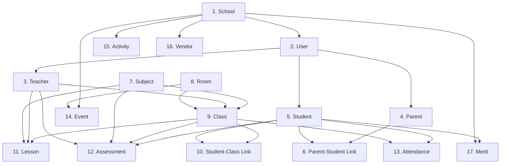

# School Synthetic Data Generator - Architecture Plan

## Overview

A comprehensive Python tool to generate realistic synthetic data for the Green School Management System. The tool generates data for all 15 features/APIs and properly links entities using UUIDs while supporting human-friendly lookups by name, email, and student IDs.

## Design Principles

1. **Relationship-Aware**: Understands and respects all foreign key relationships
2. **UUID Management**: Tracks all generated UUIDs for proper entity linking
3. **Name-Based Lookup**: Supports searching by name, email, student_id (not just UUID)
4. **Configurable**: YAML/JSON config for data volumes and generation rules
5. **Idempotent**: Can be run multiple times safely (creates/updates)
6. **Validation**: Validates data before sending to API
7. **Audit Trail**: Logs all operations for debugging
8. **Incremental**: Can generate data for specific features only

## Tech Stack

- **Python 3.9+**
- **Faker**: Realistic fake data generation
- **Requests**: HTTP API calls
- **PyYAML**: Configuration management
- **python-dotenv**: Environment variable management
- **Click**: CLI interface
- **Rich**: Beautiful terminal output with progress bars
- **Pydantic**: Data validation

## Directory Structure

```
tools/school-synthetic-data/
├── README.md                   # User documentation
├── ARCHITECTURE.md             # This file
├── requirements.txt            # Python dependencies
├── setup.py                    # Package setup
├── .env.example                # Example environment variables
├── config/
│   ├── __init__.py
│   ├── default.yaml            # Default configuration
│   ├── small.yaml              # Small dataset config (5 students)
│   ├── medium.yaml             # Medium dataset config (50 students)
│   └── large.yaml              # Large dataset config (200 students)
├── src/
│   ├── __init__.py
│   ├── main.py                 # CLI entry point
│   ├── config.py               # Configuration loader
│   ├── client.py               # API client wrapper
│   ├── cache.py                # UUID cache and lookup
│   ├── generator.py            # Main orchestration
│   └── generators/             # Individual entity generators
│       ├── __init__.py
│       ├── base.py             # Base generator class
│       ├── school.py           # School generator
│       ├── user.py             # User generator
│       ├── teacher.py          # Teacher generator
│       ├── parent.py           # Parent generator
│       ├── student.py          # Student generator
│       ├── parent_student.py   # Parent-Student relationship
│       ├── subject.py          # Subject generator
│       ├── room.py             # Room generator
│       ├── class_gen.py        # Class generator
│       ├── student_class.py    # Student-Class enrollment
│       ├── lesson.py           # Lesson generator
│       ├── assessment.py       # Assessment generator
│       ├── attendance.py       # Attendance generator
│       ├── event.py            # Event generator
│       ├── activity.py         # Activity generator
│       ├── vendor.py           # Vendor generator
│       └── merit.py            # Merit generator
├── tests/
│   ├── __init__.py
│   ├── test_generators.py
│   └── test_cache.py
└── examples/
    └── custom_config.yaml      # Example custom configuration
```

## Core Components

### 1. UUID Cache & Lookup System (`cache.py`)

**Purpose**: Track all generated entity UUIDs and support name-based lookups

**Key Classes**:

```python
class EntityCache:
    """
    Central cache for all generated entity UUIDs

    Supports:
    - UUID storage by entity type
    - Lookup by name/email/student_id
    - Relationship tracking
    - Export/import for persistence
    """

    def __init__(self):
        self.schools = {}        # {uuid: {name, slug, ...}}
        self.users = {}          # {uuid: {email, first_name, last_name, persona, ...}}
        self.teachers = {}       # {uuid: {user_id, employee_id, ...}}
        self.parents = {}        # {uuid: {user_id, ...}}
        self.students = {}       # {uuid: {user_id, student_id, ...}}
        self.subjects = {}       # {uuid: {code, name, ...}}
        self.rooms = {}          # {uuid: {room_number, ...}}
        self.classes = {}        # {uuid: {code, name, ...}}
        self.lessons = {}        # {uuid: {title, ...}}
        self.assessments = {}    # {uuid: {title, ...}}
        self.attendance = {}     # {uuid: {...}}
        self.events = {}         # {uuid: {title, ...}}
        self.activities = {}     # {uuid: {name, ...}}
        self.vendors = {}        # {uuid: {company_name, ...}}
        self.merits = {}         # {uuid: {...}}

        # Relationship tracking
        self.parent_students = []  # [(parent_id, student_id, relationship_type)]
        self.student_classes = []  # [(student_id, class_id, enrollment_date)]

    def add_entity(self, entity_type: str, uuid: str, data: dict):
        """Store entity with UUID"""

    def find_user_by_name(self, first_name: str, last_name: str) -> Optional[dict]:
        """Find user by name"""

    def find_user_by_email(self, email: str) -> Optional[dict]:
        """Find user by email"""

    def find_student_by_student_id(self, student_id: str) -> Optional[dict]:
        """Find student by student ID"""

    def find_teacher_by_name(self, first_name: str, last_name: str) -> Optional[dict]:
        """Find teacher by user name"""

    def find_parent_by_name(self, first_name: str, last_name: str) -> Optional[dict]:
        """Find parent by user name"""

    def get_random_entities(self, entity_type: str, count: int) -> List[dict]:
        """Get random entities of a type"""

    def export_to_json(self, filepath: str):
        """Export cache to JSON file"""

    def import_from_json(self, filepath: str):
        """Import cache from JSON file"""
```

### 2. API Client (`client.py`)

**Purpose**: Wrapper around requests library with retry logic and error handling

```python
class SchoolAPIClient:
    """
    HTTP client for Green School Management System API

    Features:
    - Automatic retry with exponential backoff
    - Request/response logging
    - Error handling and reporting
    - Support for all 15 API endpoints
    """

    def __init__(self, base_url: str, timeout: int = 30):
        self.base_url = base_url
        self.timeout = timeout
        self.session = requests.Session()

    # Generic CRUD operations
    def create(self, endpoint: str, data: dict) -> dict:
        """POST request"""

    def get(self, endpoint: str, params: dict = None) -> dict:
        """GET request"""

    def update(self, endpoint: str, entity_id: str, data: dict) -> dict:
        """PUT request"""

    def delete(self, endpoint: str, entity_id: str):
        """DELETE request"""

    # Specific endpoints for each feature
    def create_school(self, data: dict) -> dict:
    def create_user(self, data: dict) -> dict:
    def create_teacher(self, data: dict) -> dict:
    def create_parent(self, data: dict) -> dict:
    def create_student(self, data: dict) -> dict:
    def create_parent_student_relationship(self, data: dict) -> dict:
    def create_subject(self, data: dict) -> dict:
    def create_room(self, data: dict) -> dict:
    def create_class(self, data: dict) -> dict:
    def enroll_student_in_class(self, class_id: str, data: dict) -> dict:
    def create_lesson(self, data: dict) -> dict:
    def create_assessment(self, data: dict) -> dict:
    def create_attendance(self, data: dict) -> dict:
    def bulk_create_attendance(self, data: dict) -> List[dict]:
    def create_event(self, data: dict) -> dict:
    def create_activity(self, data: dict) -> dict:
    def create_vendor(self, data: dict) -> dict:
    def create_merit(self, data: dict) -> dict:

    # Lookup methods
    def list_users(self, school_id: str, **filters) -> List[dict]:
    def list_students(self, school_id: str, **filters) -> List[dict]:
    def list_teachers(self, school_id: str, **filters) -> List[dict]:
    def list_parents(self, school_id: str, **filters) -> List[dict]:
```

### 3. Base Generator (`generators/base.py`)

**Purpose**: Abstract base class for all entity generators

```python
class BaseGenerator(ABC):
    """
    Abstract base class for entity generators

    Handles:
    - Faker instance management
    - Cache access
    - API client access
    - Common generation patterns
    """

    def __init__(self, client: SchoolAPIClient, cache: EntityCache, faker: Faker):
        self.client = client
        self.cache = cache
        self.faker = faker

    @abstractmethod
    def generate(self, count: int, **kwargs) -> List[dict]:
        """Generate entities"""
        pass

    def _generate_address(self) -> dict:
        """Generate realistic address"""

    def _generate_phone(self) -> str:
        """Generate phone number"""

    def _generate_email(self, first_name: str, last_name: str, domain: str) -> str:
        """Generate email address"""
```

### 4. Configuration System (`config.py`)

**Purpose**: Load and validate configuration from YAML files

```yaml
# config/default.yaml
version: "1.0"
api:
  base_url: "http://localhost:8000"
  timeout: 30

school:
  name: "Green Valley Elementary School"
  city: "Springfield"
  state: "California"
  country: "USA"
  timezone: "America/Los_Angeles"

data_volumes:
  administrators: 2
  teachers: 10
  students: 50
  parents: 50  # Each student gets 1 parent
  subjects: 6  # Core subjects
  rooms: 15
  classes: 20  # Multiple classes per subject/grade
  lessons_per_class: 30  # Academic year worth
  assessments_per_student: 20  # Tests, quizzes, projects
  attendance_days: 90  # School days to generate
  events: 15  # School year events
  activities: 5  # Extracurricular activities
  vendors: 10
  merits_per_student: 5

generation_rules:
  # Grade distribution (1-7)
  grade_distribution:
    1: 7  # 7 students in grade 1
    2: 8
    3: 8
    4: 8
    5: 8
    6: 8
    7: 7

  # Subject configuration
  subjects:
    - code: "MATH"
      name: "Mathematics"
      category: "core"
      grade_levels: [1, 2, 3, 4, 5, 6, 7]
      color: "#FF5733"
    - code: "ELA"
      name: "English Language Arts"
      category: "core"
      grade_levels: [1, 2, 3, 4, 5, 6, 7]
      color: "#33C1FF"
    - code: "SCI"
      name: "Science"
      category: "core"
      grade_levels: [1, 2, 3, 4, 5, 6, 7]
      color: "#4CAF50"
    - code: "SS"
      name: "Social Studies"
      category: "core"
      grade_levels: [1, 2, 3, 4, 5, 6, 7]
      color: "#9C27B0"
    - code: "ART"
      name: "Art"
      category: "elective"
      grade_levels: [1, 2, 3, 4, 5, 6, 7]
      color: "#FF9800"
    - code: "PE"
      name: "Physical Education"
      category: "elective"
      grade_levels: [1, 2, 3, 4, 5, 6, 7]
      color: "#F44336"

  # Room types
  room_types:
    classroom: 10
    lab: 2
    gym: 1
    library: 1
    office: 1

  # Date ranges
  dates:
    academic_year_start: "2024-09-01"
    academic_year_end: "2025-06-30"
    current_quarter: "Q2"

  # Attendance patterns (realistic)
  attendance:
    present_rate: 0.90  # 90% present
    absent_rate: 0.05   # 5% absent
    tardy_rate: 0.03    # 3% tardy
    excused_rate: 0.02  # 2% excused/sick

  # Assessment types distribution
  assessment_types:
    test: 0.30
    quiz: 0.30
    project: 0.20
    assignment: 0.15
    exam: 0.05

  # Merit categories distribution
  merit_categories:
    academic: 0.30
    behavior: 0.25
    participation: 0.20
    leadership: 0.15
    attendance: 0.10

  # Vendor types
  vendor_types:
    food_service: 2
    supplies: 3
    maintenance: 2
    it_services: 1
    transportation: 1
    events: 1

  # Event types
  event_types:
    assembly: 3
    exam: 4
    holiday: 2
    meeting: 2
    parent_conference: 2
    field_trip: 2

output:
  log_level: "INFO"
  progress_bar: true
  export_cache: true
  cache_file: "generated_data_cache.json"
```

### 5. Main Generator Orchestrator (`generator.py`)

**Purpose**: Coordinates generation of all entities in correct order

```python
class DataGenerator:
    """
    Main orchestrator for synthetic data generation

    Manages:
    - Generation order (respects dependencies)
    - Progress reporting
    - Error recovery
    - Cache management
    """

    def __init__(self, config: dict, client: SchoolAPIClient, cache: EntityCache):
        self.config = config
        self.client = client
        self.cache = cache
        self.faker = Faker()

        # Initialize generators
        self.generators = {
            'school': SchoolGenerator(client, cache, self.faker),
            'user': UserGenerator(client, cache, self.faker),
            'teacher': TeacherGenerator(client, cache, self.faker),
            'parent': ParentGenerator(client, cache, self.faker),
            'student': StudentGenerator(client, cache, self.faker),
            'parent_student': ParentStudentGenerator(client, cache, self.faker),
            'subject': SubjectGenerator(client, cache, self.faker),
            'room': RoomGenerator(client, cache, self.faker),
            'class': ClassGenerator(client, cache, self.faker),
            'student_class': StudentClassGenerator(client, cache, self.faker),
            'lesson': LessonGenerator(client, cache, self.faker),
            'assessment': AssessmentGenerator(client, cache, self.faker),
            'attendance': AttendanceGenerator(client, cache, self.faker),
            'event': EventGenerator(client, cache, self.faker),
            'activity': ActivityGenerator(client, cache, self.faker),
            'vendor': VendorGenerator(client, cache, self.faker),
            'merit': MeritGenerator(client, cache, self.faker),
        }

    def generate_all(self, features: List[str] = None):
        """
        Generate all data in correct dependency order

        Args:
            features: List of features to generate (None = all)
        """
        # Generation order (respects dependencies)
        generation_order = [
            'school',           # 1. School first
            'user',             # 2. Users (all personas)
            'teacher',          # 3. Teachers (requires User)
            'parent',           # 4. Parents (requires User)
            'student',          # 5. Students (requires User)
            'parent_student',   # 6. Parent-Student relationships
            'subject',          # 7. Subjects
            'room',             # 8. Rooms
            'class',            # 9. Classes (requires Subject, Teacher, Room)
            'student_class',    # 10. Student-Class enrollments
            'lesson',           # 11. Lessons (requires Class, Teacher, Subject)
            'assessment',       # 12. Assessments
            'attendance',       # 13. Attendance
            'event',            # 14. Events
            'activity',         # 15. Activities
            'vendor',           # 16. Vendors
            'merit',            # 17. Merits
        ]

        # Filter by requested features
        if features:
            generation_order = [f for f in generation_order if f in features]

        console = Console()

        with Progress() as progress:
            task = progress.add_task("[green]Generating data...", total=len(generation_order))

            for feature in generation_order:
                console.print(f"\n[bold blue]Generating {feature}...[/bold blue]")

                try:
                    generator = self.generators[feature]
                    count = self._get_count_for_feature(feature)

                    entities = generator.generate(count)

                    console.print(f"[green]✓[/green] Generated {len(entities)} {feature} records")

                except Exception as e:
                    console.print(f"[red]✗[/red] Error generating {feature}: {str(e)}")
                    raise

                progress.advance(task)

        # Export cache
        if self.config['output']['export_cache']:
            cache_file = self.config['output']['cache_file']
            self.cache.export_to_json(cache_file)
            console.print(f"\n[green]✓[/green] Exported cache to {cache_file}")

    def _get_count_for_feature(self, feature: str) -> int:
        """Get configured count for a feature"""
        # Look up in config data_volumes
```

### 6. Individual Entity Generators

Each generator handles a specific entity type. Example:

#### Student Generator (`generators/student.py`)

```python
class StudentGenerator(BaseGenerator):
    """
    Generate student records

    Responsibilities:
    - Create User with 'student' persona
    - Create Student profile linked to User
    - Distribute across grade levels
    - Assign student IDs
    """

    def generate(self, count: int, **kwargs) -> List[dict]:
        """Generate student records"""
        students = []
        school = self.cache.schools[list(self.cache.schools.keys())[0]]
        school_id = school['id']

        # Get grade distribution from config
        grade_dist = kwargs.get('grade_distribution', {
            1: 7, 2: 8, 3: 8, 4: 8, 5: 8, 6: 8, 7: 7
        })

        student_id_counter = 1000

        for grade, count_per_grade in grade_dist.items():
            for i in range(count_per_grade):
                # 1. Create User first
                first_name = self.faker.first_name()
                last_name = self.faker.last_name()

                user_data = {
                    "school_id": school_id,
                    "email": self._generate_email(first_name, last_name, school['email'].split('@')[1]),
                    "first_name": first_name,
                    "last_name": last_name,
                    "persona": "student",
                    "status": "active",
                    "password": "Student123!",
                }

                user = self.client.create_user(user_data)
                self.cache.add_entity('user', user['id'], user)

                # 2. Create Student profile
                student_data = {
                    "school_id": school_id,
                    "user_id": user['id'],
                    "student_id": f"STU{student_id_counter:05d}",
                    "grade_level": grade,
                    "date_of_birth": self.faker.date_of_birth(
                        minimum_age=grade + 5,
                        maximum_age=grade + 7
                    ).isoformat(),
                    "gender": self.faker.random_element(['male', 'female', 'other']),
                    "enrollment_date": "2024-09-01",
                    "status": "enrolled",
                }

                student = self.client.create_student(student_data)
                self.cache.add_entity('student', student['id'], {
                    **student,
                    'user': user,
                    'first_name': first_name,
                    'last_name': last_name,
                })

                students.append(student)
                student_id_counter += 1

        return students
```

#### Parent-Student Relationship Generator (`generators/parent_student.py`)

```python
class ParentStudentGenerator(BaseGenerator):
    """
    Link parents to students (1 parent per student)
    """

    def generate(self, count: int = None, **kwargs) -> List[dict]:
        """
        Create parent-student relationships

        Strategy: Each student gets 1 parent
        """
        relationships = []
        school = self.cache.schools[list(self.cache.schools.keys())[0]]
        school_id = school['id']

        # Get all students
        students = list(self.cache.students.values())

        # Get all parents
        parents = list(self.cache.parents.values())

        if len(parents) < len(students):
            raise ValueError(f"Not enough parents ({len(parents)}) for students ({len(students)})")

        # Assign 1 parent to each student
        for i, student in enumerate(students):
            parent = parents[i]

            relationship_data = {
                "school_id": school_id,
                "parent_id": parent['id'],
                "student_id": student['id'],
                "relationship_type": self.faker.random_element([
                    'mother', 'father', 'guardian'
                ]),
                "is_primary_contact": True,
                "has_pickup_permission": True,
                "can_approve_forms": True,
            }

            relationship = self.client.create_parent_student_relationship(relationship_data)
            self.cache.parent_students.append((parent['id'], student['id'], relationship_data['relationship_type']))
            relationships.append(relationship)

        return relationships
```

#### Class Generator (`generators/class_gen.py`)

```python
class ClassGenerator(BaseGenerator):
    """
    Generate class records

    Responsibilities:
    - Link Subject, Teacher, Room
    - Distribute across grades
    - Set quarter and academic year
    """

    def generate(self, count: int, **kwargs) -> List[dict]:
        """Generate class records"""
        classes = []
        school = self.cache.schools[list(self.cache.schools.keys())[0]]
        school_id = school['id']

        # Get entities needed for classes
        subjects = list(self.cache.subjects.values())
        teachers = list(self.cache.teachers.values())
        rooms = [r for r in self.cache.rooms.values() if r['room_type'] == 'classroom']

        grade_levels = [1, 2, 3, 4, 5, 6, 7]
        quarters = ['Q1', 'Q2', 'Q3', 'Q4']

        class_counter = 1

        for grade in grade_levels:
            for subject in subjects:
                # Check if subject is taught at this grade
                if grade not in subject['grade_levels']:
                    continue

                # Assign a teacher (prefer teachers who teach this grade)
                eligible_teachers = [
                    t for t in teachers
                    if grade in t.get('grade_levels', [])
                ]
                if not eligible_teachers:
                    eligible_teachers = teachers

                teacher = self.faker.random_element(eligible_teachers)

                # Assign a room
                room = self.faker.random_element(rooms)

                class_data = {
                    "school_id": school_id,
                    "subject_id": subject['id'],
                    "teacher_id": teacher['id'],
                    "room_id": room['id'],
                    "code": f"{subject['code']}{grade}{class_counter:02d}",
                    "name": f"Grade {grade} {subject['name']}",
                    "grade_level": grade,
                    "quarter": "Q2",  # Current quarter
                    "academic_year": "2024-2025",
                    "max_students": 25,
                    "is_active": True,
                }

                class_obj = self.client.create_class(class_data)
                self.cache.add_entity('class', class_obj['id'], {
                    **class_obj,
                    'subject': subject,
                    'teacher': teacher,
                    'room': room,
                })

                classes.append(class_obj)
                class_counter += 1

        return classes
```

## Generation Dependencies



## CLI Interface

```bash
# Install
pip install -e .

# Generate all data with default config
python -m src.main generate --config config/default.yaml

# Generate all data with custom config
python -m src.main generate --config my_config.yaml

# Generate specific features only
python -m src.main generate --features students,classes,lessons

# Generate small dataset
python -m src.main generate --config config/small.yaml

# Generate medium dataset
python -m src.main generate --config config/medium.yaml

# Generate large dataset
python -m src.main generate --config config/large.yaml

# Use existing cache (for incremental generation)
python -m src.main generate --cache generated_data_cache.json --features assessments,attendance

# Export cache
python -m src.main export-cache --output my_cache.json

# Import cache
python -m src.main import-cache --input my_cache.json

# List generated entities
python -m src.main list --type students
python -m src.main list --type teachers
python -m src.main list --type classes

# Find entity by name
python -m src.main find --type student --name "John Doe"
python -m src.main find --type teacher --name "Jane Smith"

# Find entity by student ID
python -m src.main find --type student --student-id "STU01001"

# Validate configuration
python -m src.main validate-config --config my_config.yaml

# Clean up (delete all generated data)
python -m src.main cleanup --confirm
```

## Error Handling

1. **API Errors**: Retry with exponential backoff (3 attempts)
2. **Validation Errors**: Log and skip invalid records
3. **Missing Dependencies**: Check cache before generating
4. **Partial Failures**: Continue generation, report at end
5. **Network Errors**: Retry with backoff, fail gracefully

## Testing Strategy

1. **Unit Tests**: Each generator in isolation
2. **Integration Tests**: Full generation pipeline
3. **API Tests**: Verify all endpoints work
4. **Cache Tests**: Verify lookup functions
5. **Config Tests**: Validate configuration loading

## Performance Considerations

1. **Batch Creation**: Group API calls where possible (e.g., bulk attendance)
2. **Connection Pooling**: Reuse HTTP connections
3. **Progress Reporting**: Show progress for long operations
4. **Async Support**: Future enhancement for parallel generation
5. **Memory Management**: Stream large datasets

## Output Examples

### Console Output
```
🚀 Starting Green School Data Generator

[1/17] Generating school...
   ✓ Created school: Green Valley Elementary School (ID: a1b2c3d4...)

[2/17] Generating users...
   ✓ Created 2 administrators
   ✓ Created 10 teachers
   ✓ Created 50 students
   ✓ Created 50 parents

[3/17] Generating teachers...
   ✓ Linked 10 teacher profiles

[4/17] Generating parents...
   ✓ Linked 50 parent profiles

[5/17] Generating students...
   ✓ Created 50 student profiles

[6/17] Generating parent-student relationships...
   ✓ Linked 50 parent-student relationships

[7/17] Generating subjects...
   ✓ Created 6 subjects

[8/17] Generating rooms...
   ✓ Created 15 rooms

[9/17] Generating classes...
   ✓ Created 42 classes (6 subjects × 7 grades)

[10/17] Generating student enrollments...
   ✓ Enrolled 50 students in classes

[11/17] Generating lessons...
   ✓ Created 1,260 lessons (30 per class)

[12/17] Generating assessments...
   ✓ Created 1,000 assessments

[13/17] Generating attendance...
   ✓ Created 4,500 attendance records (90 days)

[14/17] Generating events...
   ✓ Created 15 school events

[15/17] Generating activities...
   ✓ Created 5 extracurricular activities

[16/17] Generating vendors...
   ✓ Created 10 vendor records

[17/17] Generating merits...
   ✓ Created 250 merit awards

✅ Data generation complete!

Summary:
  Schools: 1
  Users: 112
  Teachers: 10
  Parents: 50
  Students: 50
  Subjects: 6
  Rooms: 15
  Classes: 42
  Lessons: 1,260
  Assessments: 1,000
  Attendance: 4,500
  Events: 15
  Activities: 5
  Vendors: 10
  Merits: 250

Cache exported to: generated_data_cache.json
```

## API Endpoint Reference

All endpoints follow the pattern: `{base_url}/api/v1/{resource}`

### Endpoint List

| Feature | Endpoint | Method | Required Fields |
|---------|----------|--------|----------------|
| Users | `/api/v1/users` | POST | school_id, email, first_name, last_name, persona, password |
| Schools | `/api/v1/schools` | POST | name, address_line1, city, state, country, phone, email |
| Teachers | `/api/v1/teachers` | POST | school_id, user_id, employee_id, hire_date, grade_levels |
| Parents | `/api/v1/parents` | POST | school_id, user_id |
| Students | `/api/v1/students` | POST | school_id, user_id, student_id, grade_level, enrollment_date |
| Parent-Student | `/api/v1/parents/{parent_id}/students` | POST | student_id, relationship_type |
| Subjects | `/api/v1/subjects` | POST | school_id, code, name, grade_levels |
| Rooms | `/api/v1/rooms` | POST | school_id, room_number, room_type, capacity |
| Classes | `/api/v1/classes` | POST | school_id, subject_id, teacher_id, code, name, grade_level, quarter |
| Student-Class | `/api/v1/classes/{class_id}/students` | POST | student_id, enrollment_date |
| Lessons | `/api/v1/lessons` | POST | school_id, class_id, teacher_id, subject_id, title, scheduled_date |
| Assessments | `/api/v1/assessments` | POST | school_id, student_id, class_id, subject_id, teacher_id, title, assessment_type, quarter |
| Attendance | `/api/v1/attendance` | POST | school_id, student_id, attendance_date, status |
| Attendance (Bulk) | `/api/v1/attendance/bulk` | POST | attendance_date, class_id, student_statuses[] |
| Events | `/api/v1/events` | POST | school_id, title, event_type, start_date, end_date |
| Activities | `/api/v1/activities` | POST | school_id, name, activity_type |
| Vendors | `/api/v1/vendors` | POST | school_id, company_name, vendor_type, status |
| Merits | `/api/v1/merits` | POST | school_id, student_id, awarded_by_id, category, points, reason |

## Configuration Examples

### Small Dataset (Testing)
```yaml
data_volumes:
  teachers: 3
  students: 10
  classes: 6
  lessons_per_class: 10
  attendance_days: 30
```

### Medium Dataset (Demo)
```yaml
data_volumes:
  teachers: 10
  students: 50
  classes: 20
  lessons_per_class: 30
  attendance_days: 90
```

### Large Dataset (Production-like)
```yaml
data_volumes:
  teachers: 30
  students: 200
  classes: 60
  lessons_per_class: 40
  attendance_days: 180
```

## Future Enhancements

1. **Async Generation**: Parallel API calls for faster generation
2. **Data Validation**: Pre-validate before API calls
3. **Dry Run Mode**: Show what would be generated without creating
4. **Update Mode**: Update existing entities instead of creating
5. **Delete Mode**: Clean up specific features
6. **Report Generation**: Generate summary reports in HTML/PDF
7. **Custom Generators**: Plugin system for custom entity types
8. **Database Direct**: Option to insert directly into PostgreSQL
9. **GraphQL Support**: Alternative to REST API
10. **Web UI**: Browser-based configuration and generation

## Security Considerations

1. **Environment Variables**: Store API credentials in `.env`
2. **Cache Files**: Don't commit cache files with UUIDs
3. **Passwords**: Use strong default passwords
4. **API Keys**: Support API key authentication
5. **HTTPS**: Enforce HTTPS in production

## Maintenance

1. **Keep in sync with API**: Update when new endpoints added
2. **Version management**: Track tool version with API version
3. **Documentation**: Keep README and examples up to date
4. **Testing**: Run tests before each release
5. **Changelog**: Document all changes

## License

Same as main project (to be determined)
